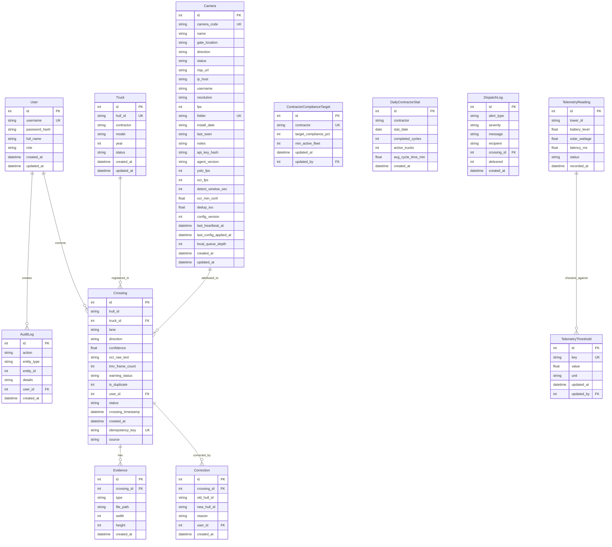

# Data Model — Source of Truth #4

**Document Version:** v1.0  
**Project:** Smart Gate — Integrated Smart Hauling System (ISHS)  
**Status:** Draft  
**Last Updated:** 2026-08-02  
**Author:** System Analyst AI  
**Source:** Derived from `docs/PRD.md` (SoT-1) and `docs/information_architecture.md` (SoT-2).
Edge-device fields additionally derived from `docs/edge-system/SRS.md` §9.

---

## 1. Overview

This document defines the core entities, relationships, and data rules for the Smart Gate ISHS. The model supports the four epics from the PRD: edge OCR detection, rugged infrastructure, hybrid telemetry, and analytics dashboard.

---

## 2. Entity Relationship Diagram

> **Edge-system fields on `Camera` and `Crossing`** (from `api_key_hash` through
> `local_queue_depth` on `Camera`, and `idempotency_key`/`source` on `Crossing` below) are
> additive fields for the live edge-device pipeline defined in `docs/edge-system/SRS.md` §9 —
> **implemented**; the migrations live in `app/repositories/camera_repo.py::EDGE_CAMERA_COLUMNS`
> and `app/repositories/run_write_repo.py::VIDEO_RESULT_EDGE_COLUMNS` (see
> `plans/next-implementation/01-schema-foundations.md`). Everything else in this document
> predates and is independent of that work.
>
> **Note on `Crossing`:** the physical table backing it is `video_results`; there is no literal
> `crossings` table in this codebase. `GET /api/crossings` is a computed view assembled by
> `app/services/dataset.py::build_dataset()`.

---

## 3. Entity Descriptions

### 3.1 User

System users (supervisors, administrators).

| Attribute | Type | Constraints | Description |
|-----------|------|------------|-------------|
| id | INTEGER | PK, AUTOINCREMENT | Unique user ID |
| username | VARCHAR(50) | UNIQUE, NOT NULL | Login username |
| password_hash | VARCHAR(255) | NOT NULL | bcrypt hash |
| full_name | VARCHAR(100) | NOT NULL | Display name |
| role | VARCHAR(20) | NOT NULL, DEFAULT 'supervisor' | `supervisor` or `admin` |
| created_at | TIMESTAMP | NOT NULL, DEFAULT NOW() | |
| updated_at | TIMESTAMP | NOT NULL, DEFAULT NOW() | |

### 3.2 Truck

Master registry of OHT fleet vehicles.

| Attribute | Type | Constraints | Description |
|-----------|------|------------|-------------|
| id | INTEGER | PK, AUTOINCREMENT | |
| hull_id | VARCHAR(20) | UNIQUE, NOT NULL | Vehicle hull number (e.g. `DT-118`) |
| contractor | VARCHAR(100) | NOT NULL | Subcontractor company name |
| model | VARCHAR(50) | | Cat 777 / Cat 773 / etc. |
| year | INTEGER | | Manufacture year |
| status | VARCHAR(20) | NOT NULL, DEFAULT 'active' | `active`, `inactive`, `retired` |
| created_at | TIMESTAMP | NOT NULL, DEFAULT NOW() | |
| updated_at | TIMESTAMP | NOT NULL, DEFAULT NOW() | |

### 3.3 Crossing

Core event — a single detected OHT passage through a gate checkpoint.

| Attribute | Type | Constraints | Description |
|-----------|------|------------|-------------|
| id | INTEGER | PK, AUTOINCREMENT | |
| hull_id | VARCHAR(20) | NOT NULL | Detected OCR hull ID (may differ from registered) |
| truck_id | INTEGER | FK → Truck.id, NULLABLE | Matched fleet truck (NULL if unregistered) |
| lane | VARCHAR(20) | NOT NULL | Gate/checkpoint name (CK, PPA, South-1) |
| direction | VARCHAR(10) | NOT NULL | `IN` (loading) or `OUT` (dumping) |
| confidence | FLOAT | NOT NULL, DEFAULT 0.0 | OCR confidence score 0.0–100.0 |
| ocr_raw_text | TEXT | | Raw OCR output before normalization |
| tmv_frame_count | INTEGER | | Number of TMV consensus frames |
| warning_status | VARCHAR(20) | DEFAULT NULL | `low_confidence`, `unregistered`, `duplicate`, NULL |
| is_duplicate | INTEGER | DEFAULT 0 | 1 = flagged as duplicate (< 10s gap) |
| user_id | INTEGER | FK → User.id, NULLABLE | Supervisor who verified/corrected |
| status | VARCHAR(20) | NOT NULL, DEFAULT 'pending' | `pending`, `verified`, `corrected`, `rejected` |
| crossing_timestamp | TIMESTAMP | NOT NULL | UTC time of detection |
| created_at | TIMESTAMP | NOT NULL, DEFAULT NOW() | |
| idempotency_key | VARCHAR(36) | UNIQUE, **NULLABLE** | Edge-generated UUID v4; de-duplicates retried submissions from an edge device (`docs/edge-system/SRS.md` §5.2). The `UNIQUE` index is the actual concurrency-safe guard, not an application check. Nullable by necessity: every pre-existing batch row has no key, and SQLite treats NULLs as distinct in a UNIQUE index, which is exactly what lets both sources share one table. |
| source | VARCHAR(10) | NOT NULL, DEFAULT 'batch' | `batch` (existing playlist pipeline) or `edge` (live `POST /edge/crossings` ingestion) — lets reports distinguish provenance (`docs/edge-system/SRS.md` §9). |

### 3.4 Evidence

Image proof files for each crossing.

| Attribute | Type | Constraints | Description |
|-----------|------|------------|-------------|
| id | INTEGER | PK, AUTOINCREMENT | |
| crossing_id | INTEGER | FK → Crossing.id, NOT NULL | |
| type | VARCHAR(20) | NOT NULL | `crop` (hull number crop) or `context` (wide angle) |
| file_path | VARCHAR(500) | NOT NULL | Relative path to image file |
| width | INTEGER | | Image pixel width |
| height | INTEGER | | Image pixel height |
| created_at | TIMESTAMP | NOT NULL, DEFAULT NOW() | |

### 3.5 Correction

Audit trail for manual hull ID corrections.

| Attribute | Type | Constraints | Description |
|-----------|------|------------|-------------|
| id | INTEGER | PK, AUTOINCREMENT | |
| crossing_id | INTEGER | FK → Crossing.id, NOT NULL | |
| old_hull_id | VARCHAR(20) | NOT NULL | Hull ID before correction |
| new_hull_id | VARCHAR(20) | NOT NULL | Hull ID after correction |
| reason | VARCHAR(200) | | Reason for correction |
| user_id | INTEGER | FK → User.id, NOT NULL | Supervisor who made correction |
| created_at | TIMESTAMP | NOT NULL, DEFAULT NOW() | |

### 3.6 TelemetryReading

Periodic sensor readings from remote skid towers.

| Attribute | Type | Constraints | Description |
|-----------|------|------------|-------------|
| id | INTEGER | PK, AUTOINCREMENT | |
| tower_id | VARCHAR(20) | NOT NULL | Tower identifier (Alpha, Beta, Gamma, Delta) |
| battery_level | FLOAT | | Battery percentage 0.0–100.0 |
| solar_wattage | FLOAT | | Solar panel output in watts |
| latency_ms | FLOAT | | Network latency in milliseconds |
| status | VARCHAR(20) | DEFAULT 'online' | `online`, `warning`, `offline` |
| recorded_at | TIMESTAMP | NOT NULL, DEFAULT NOW() | UTC telemetry timestamp |

### 3.7 TelemetryThreshold

Configurable alert threshold values.

| Attribute | Type | Constraints | Description |
|-----------|------|------------|-------------|
| id | INTEGER | PK, AUTOINCREMENT | |
| key | VARCHAR(50) | UNIQUE, NOT NULL | `battery_low`, `solar_low`, `latency_high` |
| value | FLOAT | NOT NULL | Threshold value |
| unit | VARCHAR(20) | | `percent`, `watts`, `ms` |
| updated_at | TIMESTAMP | NOT NULL, DEFAULT NOW() | |
| updated_by | INTEGER | FK → User.id | Admin who last changed |

### 3.8 AuditLog

Chronological log of all system actions.

| Attribute | Type | Constraints | Description |
|-----------|------|------------|-------------|
| id | INTEGER | PK, AUTOINCREMENT | |
| action | VARCHAR(50) | NOT NULL | `crossing_corrected`, `threshold_updated`, `truck_registered`, `export_triggered`, etc. |
| entity_type | VARCHAR(50) | | `crossing`, `truck`, `threshold`, `user` |
| entity_id | INTEGER | | ID of affected entity |
| details | TEXT | | JSON blob with action details |
| user_id | INTEGER | FK → User.id | Who performed action |
| created_at | TIMESTAMP | NOT NULL, DEFAULT NOW() | |

### 3.9 ContractorComplianceTarget

Expected performance targets per subcontractor.

| Attribute | Type | Constraints | Description |
|-----------|------|------------|-------------|
| id | INTEGER | PK, AUTOINCREMENT | |
| contractor | VARCHAR(100) | UNIQUE, NOT NULL | Subcontractor name |
| target_compliance_pct | INTEGER | NOT NULL, DEFAULT 85 | Target compliance % |
| min_active_fleet | INTEGER | NOT NULL, DEFAULT 5 | Minimum active trucks expected |
| updated_at | TIMESTAMP | NOT NULL, DEFAULT NOW() | |
| updated_by | INTEGER | FK → User.id | |

### 3.10 DailyContractorStat

Pre-aggregated daily statistics per contractor.

| Attribute | Type | Constraints | Description |
|-----------|------|------------|-------------|
| id | INTEGER | PK, AUTOINCREMENT | |
| contractor | VARCHAR(100) | NOT NULL | |
| stat_date | DATE | NOT NULL | |
| completed_cycles | INTEGER | DEFAULT 0 | |
| active_trucks | INTEGER | DEFAULT 0 | Trucks with crossings today |
| avg_cycle_time_min | FLOAT | | Average minutes per full cycle |
| created_at | TIMESTAMP | NOT NULL, DEFAULT NOW() | |

### 3.12 Camera

Master registry of cameras installed at each mining gate. Enables scalable
multi-gate deployment: every processed video/crossing is attributed to a camera
by the playlist subfolder its video lives in (`data/01-playlist/<folder>/`), and
`video_results.camera_id` tags each row so per-camera data stays isolated within
one database yet remains viewable together.

| Attribute | Type | Constraints | Description |
|-----------|------|------------|-------------|
| id | INTEGER | PK, AUTOINCREMENT | |
| camera_code | VARCHAR(50) | UNIQUE, NOT NULL | Operator code (e.g. `CK-GATE-A`) |
| name | VARCHAR(100) | NOT NULL | Display name |
| gate_location | VARCHAR(100) | | Gate/checkpoint this camera watches |
| direction | VARCHAR(10) | DEFAULT 'both' | `inbound`, `outbound`, or `both` |
| status | VARCHAR(20) | DEFAULT 'offline' | `online`, `offline`, `maintenance` |
| rtsp_url | VARCHAR(500) | | RTSP stream URL |
| ip_host | VARCHAR(100) | | Camera IP / hostname |
| username | VARCHAR(100) | | Connection username |
| resolution | VARCHAR(20) | | e.g. `1920x1080` |
| fps | INTEGER | | Frames per second |
| folder | VARCHAR(200) | UNIQUE | Playlist subfolder used for attribution (`''` = root) |
| install_date | TEXT | | Installation date |
| last_seen | TEXT | | Last online timestamp |
| notes | TEXT | | Free-form operator notes |
| api_key_hash | VARCHAR(255) | NULLABLE | Hashed edge-device credential; NULL until provisioned. Never returned by any read endpoint (`docs/edge-system/SRS.md` §7.3). |
| agent_version | VARCHAR(20) | NULLABLE | Edge agent software version, reported at heartbeat. |
| yolo_fps | INTEGER | NOT NULL, DEFAULT 20 | Edge-configurable — `docs/edge-system/PRD.md` §9. |
| ocr_fps | INTEGER | NOT NULL, DEFAULT 4 | Edge-configurable. |
| detect_window_sec | INTEGER | NOT NULL, DEFAULT 6 | Edge-configurable — max Detection Window duration. |
| ocr_min_conf | FLOAT | NOT NULL, DEFAULT 0.30 | Edge-configurable. |
| dedup_iou | FLOAT | NOT NULL, DEFAULT 0.92 | Edge-configurable. |
| config_version | INTEGER | NOT NULL, DEFAULT 1 | Incremented on every settings write; device reports back the version it applied. |
| applied_config_version | INTEGER | NOT NULL, DEFAULT 0 | Last `config_version` the device confirmed applying, stored verbatim as reported at heartbeat. `0` = never confirmed. The dashboard's saved-vs-pending indicator is exactly `applied_config_version == config_version`. Stored rather than derived: once `config_version` advances again, a timestamp alone cannot say which version it referred to. |
| last_heartbeat_at | TIMESTAMP | NULLABLE | Drives the offline sweep (`docs/edge-system/SRS.md` §5.1). |
| last_config_applied_at | TIMESTAMP | NULLABLE | Shown as "settings saved" timestamp on the dashboard. |
| local_queue_depth | INTEGER | NOT NULL, DEFAULT 0 | Last-reported on-device outbox size, for the health widget. |
| created_at | TIMESTAMP | DEFAULT NOW() | |
| updated_at | TIMESTAMP | DEFAULT NOW() | |

> **Edge fields** (`api_key_hash` through `local_queue_depth`): **implemented** — see
> `docs/edge-system/SRS.md` §9 for the design and `docs/edge-system/API_CONTRACT.md` for the
> endpoints that read/write them. `api_key_hash` is stripped by
> `app/services/edge_config.py::attach_health_fields` and is never returned by any endpoint.

> **Attribution:** `video_results.camera_id` (nullable, `→ Camera.id ON DELETE SET NULL`) links a processed video to its camera. Resolved from the video's playlist folder; NULL / unmatched reads as "Unassigned Gate" — no camera identity is fabricated.

### 3.11 DispatchLog

Record of dispatched alert notifications (email/SMS simulation).

| Attribute | Type | Constraints | Description |
|-----------|------|------------|-------------|
| id | INTEGER | PK, AUTOINCREMENT | |
| alert_type | VARCHAR(50) | NOT NULL | `low_confidence`, `battery_critical`, `latency_high` |
| severity | VARCHAR(20) | NOT NULL | `high`, `medium`, `low` |
| message | TEXT | NOT NULL | Dispatch message body |
| recipient | VARCHAR(200) | | Recipient identifier |
| crossing_id | INTEGER | FK → Crossing.id, NULLABLE | Related crossing (if applicable) |
| delivered | INTEGER | DEFAULT 1 | 1 = delivered, 0 = failed |
| created_at | TIMESTAMP | NOT NULL, DEFAULT NOW() | |

---

## 4. Indexes

| Table | Index Name | Columns | Purpose |
|-------|-----------|---------|---------|
| truck | idx_truck_hull_id | hull_id | Fast OHT lookup by hull number |
| truck | idx_truck_contractor | contractor | Filter by subcontractor |
| crossing | idx_crossing_timestamp | crossing_timestamp | Time-range report queries |
| crossing | idx_crossing_hull_id | hull_id | Search by detected hull ID |
| crossing | idx_crossing_truck_id | truck_id | Join to fleet registry |
| crossing | idx_crossing_lane | lane | Gate-specific queries |
| crossing | idx_crossing_duplicate | is_duplicate | Filter duplicates from stats |
| evidence | idx_evidence_crossing | crossing_id | Lookup proof images |
| telemetry | idx_telemetry_tower_time | tower_id, recorded_at | Trend queries per tower |
| audit_log | idx_audit_created | created_at | Chronological audit sort |

---

## 5. Business Rules

| ID | Rule | Source |
|----|------|--------|
| BR-001 | Crossing with `confidence < 85%` must auto-set `warning_status = 'low_confidence'` | PRD KPI #1 |
| BR-002 | Crossing with unmatched `hull_id` (no Truck record) must auto-set `warning_status = 'unregistered'` | PRD Phase 1 Fleet Setup |
| BR-003 | Two crossings for same `hull_id` at same `lane` within 10 seconds → mark second as `is_duplicate = 1` | PRD Phase 1 |
| BR-004 | `truck_id` is NULL until hull_id is matched or a correction assigns it | BR-002 |
| BR-005 | Telemetry `battery_level < 30%` or `latency_ms > 400` for 3 consecutive readings → trigger alert dispatch | PRD Risk: Monsoon Outages |
| BR-006 | Correction creates an AuditLog entry AND updates Crossing.hull_id + truck_id | PRD Epic 4 |
| BR-007 | Daily contractor stats are computed at midnight from completed crossings | PRD Shift Reporting |
| BR-008 | Image evidence files must exist at `file_path` on disk for every crossing | PRD KPI #4 |
| BR-009 | Every crossing must have at least 1 crop + 1 context evidence record | PRD UX Workflow |
| BR-010 | `Crossing.idempotency_key` is `UNIQUE`; a `POST /edge/crossings` retry with an already-seen key returns the existing row instead of inserting a duplicate | `docs/edge-system/SRS.md` §5.2 |
| BR-011 | `Camera.status` flips to `offline` if `last_heartbeat_at` is older than 3× the heartbeat interval (90s), overriding a stale `maintenance` self-report | `docs/edge-system/SRS.md` §5.1 |
| BR-012 | A `PUT` to a camera's edge-config increments `Camera.config_version` by exactly 1; the device's `local_queue_depth`/`last_config_applied_at` update only via its own heartbeat, never directly by the write | `docs/edge-system/SRS.md` §5.3 |

---

## 6. Traceability (PRD → Data Model)

| PRD Section | Entities |
|-------------|----------|
| Epic 1: Edge OCR / TMV | Crossing, Evidence |
| Epic 2: Rugged Infrastructure | TelemetryReading |
| Epic 3: Hybrid Fail-Safe Telemetry | TelemetryReading, DispatchLog |
| Epic 4: Analytics Dashboard | Crossing, Truck, ContractorComplianceTarget, DailyContractorStat |
| Phase 1: Fleet Master Database | Truck, User |
| Phase 1: Real-Time Dashboards | Crossing, Evidence |
| Risk: Power Outages | TelemetryReading, TelemetryThreshold |
| Risk: Master Data Integration | Truck |
| Shift Reporting | DailyContractorStat, Crossing |
| Audit & Verification | Correction, AuditLog |
| `docs/edge-system/PRD.md` Goals 1–5 (edge inference, settings, sync, auth, health) | Camera (edge fields), Crossing (`idempotency_key`, `source`) |
| `docs/edge-system/PRD.md` Goals 6–7 (live raw CCTV view, no overlay) | Camera (identity only — live sessions are ephemeral, not persisted; see `docs/edge-system/SRS.md` §9) |
