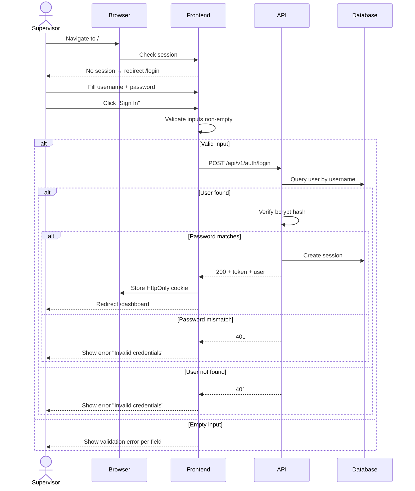

# System Logic: UC-001 User Login

**Version:** v1.0  
**Status:** Draft  
**Use Case:** UC-001  
**Related User Flow:** `docs/user_flows/userflow_uc_001.md`

---

## 1. Sequence Diagram



---

## 2. API Contract

### 2.1 POST /api/v1/auth/login

**Request:**
```json
{
  "username": "string (required)",
  "password": "string (required)"
}
```

**Success (200):**
```json
{
  "success": true,
  "data": {
    "token": "jwt-token-string",
    "user": {
      "id": 1,
      "username": "admin",
      "full_name": "Site Admin",
      "role": "admin"
    },
    "expires_in": 86400
  },
  "message": "Login successful"
}
```

**Error (401):**
```json
{
  "success": false,
  "data": null,
  "message": "Invalid username or password",
  "errors": []
}
```

### 2.2 POST /api/v1/auth/logout

Headers: `Authorization: Bearer <token>`

**Success (200):**
```json
{ "success": true, "data": null, "message": "Logged out" }
```

### 2.3 GET /api/v1/auth/me

Headers: `Authorization: Bearer <token>`

**Success (200):**
```json
{
  "success": true,
  "data": {
    "id": 1,
    "username": "admin",
    "full_name": "Site Admin",
    "role": "admin"
  },
  "message": "Authenticated"
}
```

---

## 3. Security Rules

- Passwords hashed with bcrypt (salt rounds ≥ 12)
- Token stored as HttpOnly, Secure, SameSite=Strict cookie
- Session expires after 24 hours
- Rate limit: 5 attempts/minute/IP
