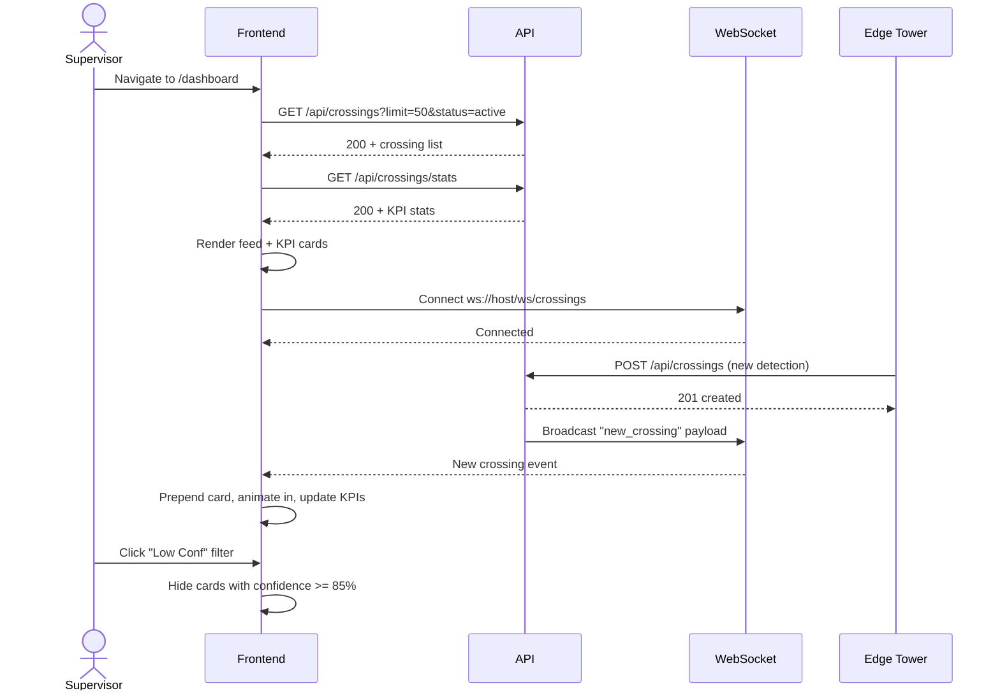

# System Logic: UC-002 View Live Crossing Feed

**Version:** v1.0  
**Status:** Draft  
**Use Case:** UC-002  
**Related User Flow:** `docs/user_flows/userflow_uc_002.md`

---

## 1. Sequence Diagram



---

## 2. API Contracts

### 2.1 GET /api/crossings

Query params: `limit` (default 50), `offset`, `status`, `lane`, `direction`, `confidence_min`, `confidence_max`, `search`, `is_duplicate`

**Success (200):**
```json
{
  "success": true,
  "data": {
    "crossings": [
      {
        "id": 1423,
        "hull_id": "DT-118",
        "truck_id": 45,
        "lane": "CK",
        "direction": "IN",
        "confidence": 97.3,
        "ocr_raw_text": "DT-118",
        "tmv_frame_count": 42,
        "warning_status": null,
        "is_duplicate": 0,
        "status": "pending",
        "crossing_timestamp": "2026-07-20T12:34:05Z",
        "has_crop": true,
        "has_context": true,
        "contractor": "PT BIB"
      }
    ],
    "total": 1247,
    "limit": 50,
    "offset": 0
  },
  "message": "Success"
}
```

### 2.2 GET /api/crossings/stats

**Success (200):**
```json
{
  "success": true,
  "data": {
    "total_crossings_today": 1247,
    "verified_crossings": 1180,
    "active_fleet_count": 89,
    "low_confidence_count": 23,
    "unregistered_count": 12,
    "completion_rate": 94.6,
    "lane_breakdown": {
      "CK_IN": 312,
      "CK_OUT": 298,
      "PPA_IN": 245,
      "PPA_OUT": 231,
      "South-1_IN": 87,
      "South-1_OUT": 74
    }
  },
  "message": "Success"
}
```

---

## 3. WebSocket Events

### 3.1 Client → Server

| Event | Payload | Description |
|-------|---------|-------------|
| `subscribe` | `{"lanes": ["CK", "PPA"]}` | Subscribe to specific lanes |
| `ping` | `{}` | Keepalive |

### 3.2 Server → Client

| Event | Payload | Description |
|-------|---------|-------------|
| `new_crossing` | Full crossing object | New detection from edge |
| `crossing_updated` | `{id, status, hull_id, confidence}` | Verification/correction broadcast |
| `kpi_update` | Stats object | Periodic KPI refresh |
| `alert` | `{type, severity, message}` | Warning/alert notification |
| `pong` | `{}` | Keepalive response |

---

## 4. Data Flow

| Step | Input | Process | Output |
|------|-------|---------|--------|
| 1 | Page load | GET /api/crossings + /stats | Initial feed + KPI render |
| 2 | WS connect | Subscribe to live events | Real-time updates |
| 3 | New crossing from edge | POST /api/crossings | Broadcast to all WS clients |
| 4 | Supervisor filter | Client-side filter + highlight | Updated visible feed |
