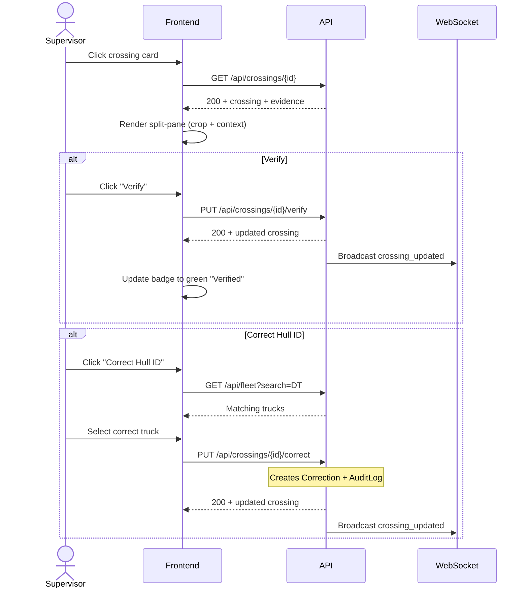

# System Logic: UC-003 Audit & Verify Crossing

**Version:** v1.0  
**Status:** Draft  
**Use Case:** UC-003  
**Related User Flow:** `docs/user_flows/userflow_uc_003.md`

---

## 1. Sequence Diagram



---

## 2. API Contracts

### 2.1 GET /api/crossings/{id}

**Success (200):**
```json
{
  "success": true,
  "data": {
    "crossing": {
      "id": 1423,
      "hull_id": "DT-118",
      "truck_id": 45,
      "lane": "CK",
      "direction": "IN",
      "confidence": 88.2,
      "ocr_raw_text": "DT-11B",
      "tmv_frame_count": 38,
      "warning_status": "low_confidence",
      "is_duplicate": 0,
      "status": "pending",
      "crossing_timestamp": "2026-07-20T12:34:05Z"
    },
    "evidence": {
      "crop": {
        "url": "/evidence/crossings/1423/crop.jpg",
        "width": 320,
        "height": 120
      },
      "context": {
        "url": "/evidence/crossings/1423/context.jpg",
        "width": 1920,
        "height": 1080
      }
    },
    "corrections": []
  },
  "message": "Success"
}
```

### 2.2 PUT /api/crossings/{id}/verify

**Request:** `{}` (empty body)

**Success (200):**
```json
{
  "success": true,
  "data": {
    "id": 1423,
    "status": "verified",
    "confidence": 100.0,
    "warning_status": null
  },
  "message": "Crossing verified"
}
```

### 2.3 PUT /api/crossings/{id}/correct

**Request:**
```json
{
  "new_hull_id": "DT-118",
  "reason": "OCR misread hyphen as letter B"
}
```

**Success (200):**
```json
{
  "success": true,
  "data": {
    "id": 1423,
    "hull_id": "DT-118",
    "truck_id": 45,
    "status": "corrected",
    "previous_hull_id": "DT-11B"
  },
  "message": "Crossing corrected"
}
```

### 2.4 POST /api/crossings/{id}/reprocess-ocr

**Request:** (multipart or JSON with bbox coords)
```json
{
  "bbox": { "x": 120, "y": 340, "w": 280, "h": 100 }
}
```

**Success (200):**
```json
{
  "success": true,
  "data": {
    "id": 1423,
    "hull_id": "DT-118",
    "confidence": 96.7,
    "ocr_raw_text": "DT-118"
  },
  "message": "OCR reprocessed"
}
```

---

## 3. Business Logic

| Rule | Implementation |
|------|---------------|
| Verify sets confidence to 100% and status to `verified` | Immediate DB update + WS broadcast |
| Correction must preserve original hull_id in Correction table | Cascade insert on PUT /correct |
| Correction triggers fleet re-matching (truck_id update) | Auto-join on new hull_id against Truck table |
| Reprocess OCR runs PaddleOCR-VL on the specified crop region | Async job, result updates crossing in-place |

---

## 4. Data Flow

| Step | Input | Process | Output |
|------|-------|---------|--------|
| 1 | crossing_id | GET crossing detail | Split-pane render |
| 2 | Verify click | PUT verify | Status update + broadcast |
| 3 | Correction form | PUT correct | Correction record + status update + broadcast |
| 4 | Bbox coordinates | POST reprocess | Re-run OCR pipeline |
