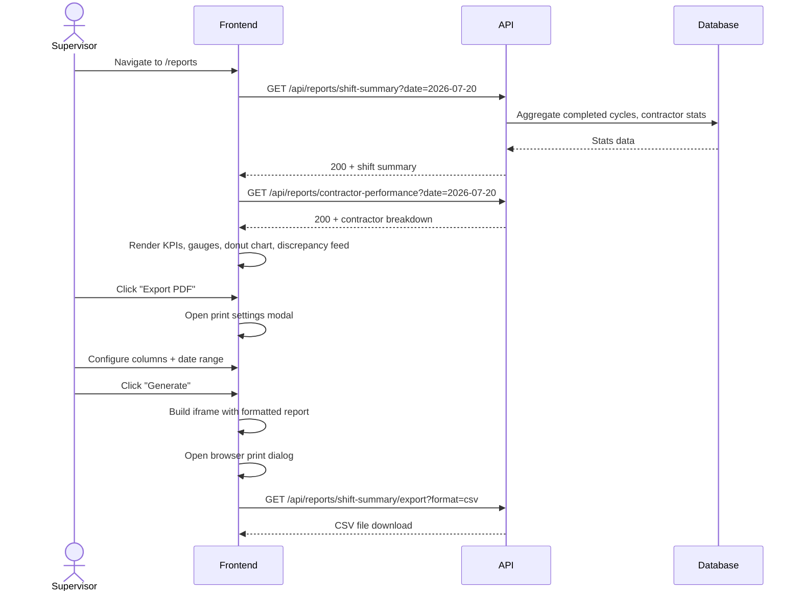

# System Logic: UC-004 Generate Shift Report

**Version:** v1.0  
**Status:** Draft  
**Use Case:** UC-004  
**Related User Flow:** `docs/user_flows/userflow_uc_004.md`

---

## 1. Sequence Diagram



---

## 2. API Contracts

### 2.1 GET /api/reports/shift-summary

Query params: `date`, `start_date`, `end_date`

**Success (200):**
```json
{
  "success": true,
  "data": {
    "period": { "start": "2026-07-20T00:00:00Z", "end": "2026-07-20T23:59:59Z" },
    "summary": {
      "total_verified_crossings": 1180,
      "total_completed_cycles": 590,
      "active_fleet_count": 89,
      "overall_compliance_pct": 91.2,
      "fleet_utilization_pct": 78.4
    },
    "shift_breakdown": [
      { "shift": "00:00-04:00", "passages": 98, "cycles": 49 },
      { "shift": "04:00-08:00", "passages": 215, "cycles": 107 },
      { "shift": "08:00-12:00", "passages": 302, "cycles": 151 },
      { "shift": "12:00-16:00", "passages": 287, "cycles": 143 },
      { "shift": "16:00-20:00", "passages": 198, "cycles": 99 },
      { "shift": "20:00-00:00", "passages": 147, "cycles": 73 }
    ],
    "discrepancies": [
      { "type": "low_confidence", "count": 23, "severity": "medium" },
      { "type": "unregistered", "count": 12, "severity": "high" },
      { "type": "cycle_discrepancy", "count": 5, "severity": "medium" }
    ]
  },
  "message": "Success"
}
```

### 2.2 GET /api/reports/contractor-performance

Query params: `date`, `start_date`, `end_date`

**Success (200):**
```json
{
  "success": true,
  "data": {
    "contractors": [
      {
        "contractor": "PT BIB",
        "completed_cycles": 310,
        "active_trucks": 42,
        "avg_cycle_time_min": 18.4,
        "compliance_pct": 94.2,
        "target_compliance": 85,
        "utilization_pct": 82.5,
        "target_min_fleet": 35
      },
      {
        "contractor": "PT TIA",
        "completed_cycles": 280,
        "active_trucks": 47,
        "avg_cycle_time_min": 19.1,
        "compliance_pct": 88.7,
        "target_compliance": 85,
        "utilization_pct": 75.3,
        "target_min_fleet": 40
      }
    ]
  },
  "message": "Success"
}
```

### 2.3 GET /api/reports/shift-summary/export

Query params: `format` (csv | json), `start_date`, `end_date`, `columns`

**Success (200):** File download with `Content-Disposition: attachment`

### 2.4 GET /api/reports/subcontractor-trends

Query params: `days` (default 7)

**Success (200):**
```json
{
  "success": true,
  "data": [
    { "date": "2026-07-14", "PT BIB": 295, "PT TIA": 270 },
    { "date": "2026-07-15", "PT BIB": 310, "PT TIA": 265 },
    { "date": "2026-07-16", "PT BIB": 288, "PT TIA": 280 }
  ],
  "message": "Success"
}
```

### 2.5 POST /api/reports/contractor-performance/send-warning

**Request:**
```json
{
  "contractor": "PT TIA",
  "recipient": "supervisor@tia.co.id",
  "message": "Compliance at 88.7% — below target of 85%. Please review fleet deployment."
}
```

**Success (200):**
```json
{
  "success": true,
  "data": { "dispatch_id": 87, "delivered": true },
  "message": "Warning dispatched"
}
```

---

## 3. Business Logic

| Rule | Implementation |
|------|---------------|
| Completed cycle = consecutive IN + OUT for same hull_id at same lane | Crossing pair analysis in SQL |
| Duplicates excluded from all stats | WHERE is_duplicate = 0 |
| Shifts = 6 x 4-hour blocks starting 00:00 | Server-side grouping by hour |
| Compliance = (verified_cycles / registered_truck_expected) * 100 | Computed per contractor |
