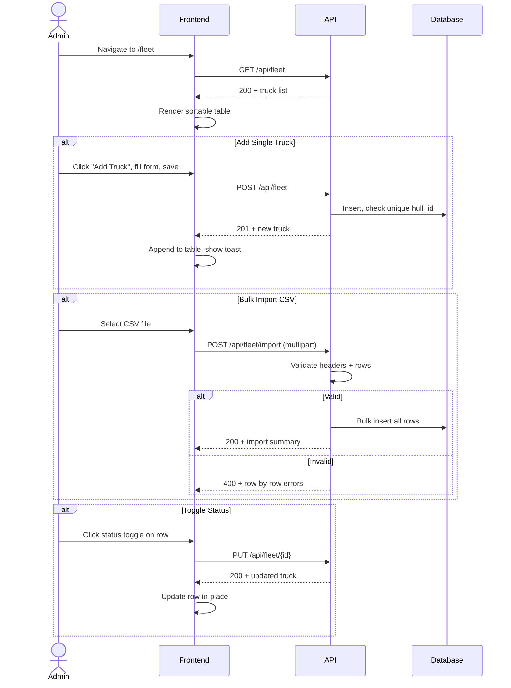

# System Logic: UC-005 Manage Fleet Registry

**Version:** v1.0  
**Status:** Draft  
**Use Case:** UC-005  
**Related User Flow:** `docs/user_flows/userflow_uc_005.md`

---

## 1. Sequence Diagram



---

## 2. API Contracts

### 2.1 GET /api/fleet

Query params: `search`, `contractor`, `status` (active | inactive | retired), `sort_by`, `sort_order`

**Success (200):**
```json
{
  "success": true,
  "data": {
    "trucks": [
      {
        "id": 45,
        "hull_id": "DT-118",
        "contractor": "PT BIB",
        "model": "CAT 777",
        "year": 2022,
        "status": "active",
        "last_crossing": "2026-07-20T12:34:05Z",
        "total_crossings": 1247
      }
    ],
    "total": 89
  },
  "message": "Success"
}
```

### 2.2 POST /api/fleet

**Request:**
```json
{
  "hull_id": "DT-119",
  "contractor": "PT TIA",
  "model": "CAT 777",
  "year": 2023
}
```

**Success (201):**
```json
{
  "success": true,
  "data": { "id": 46, "hull_id": "DT-119", "status": "active" },
  "message": "Truck registered"
}
```

**Error (400):**
```json
{
  "success": false,
  "data": null,
  "message": "Validation failed",
  "errors": [
    { "field": "hull_id", "message": "Hull ID already exists" }
  ]
}
```

### 2.3 PUT /api/fleet/{id}

**Request:** (partial update)
```json
{
  "status": "inactive",
  "model": "CAT 773"
}
```

**Success (200):**
```json
{
  "success": true,
  "data": { "id": 45, "hull_id": "DT-118", "status": "inactive" },
  "message": "Truck updated"
}
```

### 2.4 POST /api/fleet/import

Multipart form with CSV file.

**Success (200):**
```json
{
  "success": true,
  "data": {
    "imported": 25,
    "skipped": 3,
    "errors": [
      { "row": 12, "field": "hull_id", "message": "Duplicate hull_id DT-118" }
    ]
  },
  "message": "Import completed with warnings"
}
```

---

## 3. Business Logic

| Rule | Implementation |
|------|---------------|
| Hull ID must be unique | UNIQUE constraint on `hull_id` column |
| Hull ID format: uppercase alphanumeric + hyphens | Regex validation `^[A-Z0-9-]{2,20}$` |
| CSV import validates all rows before inserting | Transactional batch insert |
| Status toggle = soft update | `PUT /api/fleet/{id}` with partial body |
