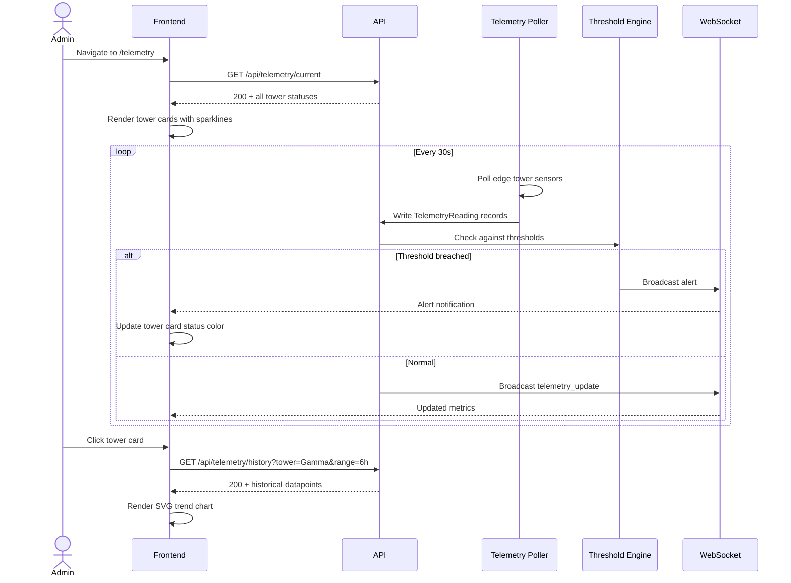

# System Logic: UC-006 Monitor Telemetry Status

**Version:** v1.0  
**Status:** Draft  
**Use Case:** UC-006  
**Related User Flow:** `docs/user_flows/userflow_uc_006.md`

---

## 1. Sequence Diagram



---

## 2. API Contracts

### 2.1 GET /api/telemetry/current

**Success (200):**
```json
{
  "success": true,
  "data": {
    "towers": [
      {
        "tower_id": "Alpha",
        "battery_level": 87.3,
        "solar_wattage": 142.5,
        "latency_ms": 23,
        "status": "online",
        "last_updated": "2026-07-20T12:34:05Z"
      },
      {
        "tower_id": "Gamma",
        "battery_level": 28.1,
        "solar_wattage": 12.3,
        "latency_ms": 451,
        "status": "warning",
        "last_updated": "2026-07-20T12:34:05Z"
      }
    ]
  },
  "message": "Success"
}
```

### 2.2 GET /api/telemetry/history

Query params: `tower` (required), `range` (1h, 6h, 24h, 7d)

**Success (200):**
```json
{
  "success": true,
  "data": {
    "tower_id": "Gamma",
    "range": "6h",
    "datapoints": [
      { "recorded_at": "2026-07-20T06:34:05Z", "battery_level": 85.2, "solar_wattage": 0, "latency_ms": 32 },
      { "recorded_at": "2026-07-20T07:04:05Z", "battery_level": 82.1, "solar_wattage": 15, "latency_ms": 28 },
      { "recorded_at": "2026-07-20T12:34:05Z", "battery_level": 28.1, "solar_wattage": 12.3, "latency_ms": 451 }
    ]
  },
  "message": "Success"
}
```

### 2.3 PUT /api/telemetry/thresholds

**Request:**
```json
{
  "battery_low": 20,
  "solar_low": 5,
  "latency_high": 500
}
```

**Success (200):**
```json
{
  "success": true,
  "data": {
    "battery_low": 20,
    "solar_low": 5,
    "latency_high": 500
  },
  "message": "Thresholds updated"
}
```

### 2.4 POST /api/telemetry/simulate

**Request:**
```json
{
  "tower_id": "Alpha",
  "overrides": {
    "battery_level": 15,
    "latency_ms": 600
  }
}
```

**Success (200):**
```json
{
  "success": true,
  "data": { "active_overrides": true },
  "message": "Simulation active for Alpha"
}
```

---

## 3. Business Logic

| Rule | Implementation |
|------|---------------|
| Telemetry polled every 30s from edge towers | Backend background task |
| 3 consecutive threshold breaches → alert dispatch | Rolling window counter |
| "Offline" = no telemetry for > 5 minutes | Timestamp delta check |
| History retained for 7 days | Auto-prune on midnight |
| Simulation overrides intercept live data reads | In-memory override map |
