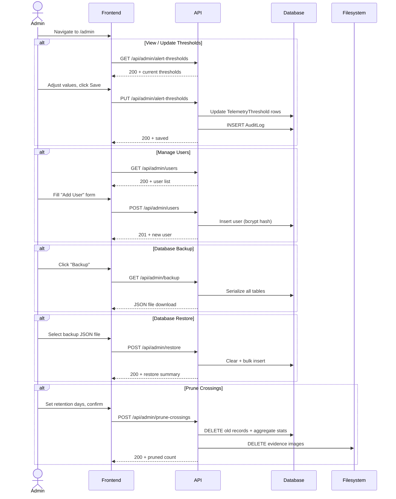

# System Logic: UC-007 Configure System

**Version:** v1.0  
**Status:** Draft  
**Use Case:** UC-007  
**Related User Flow:** `docs/user_flows/userflow_uc_007.md`

---

## 1. Sequence Diagram



---

## 2. API Contracts

### 2.1 GET /api/admin/alert-thresholds

**Success (200):**
```json
{
  "success": true,
  "data": {
    "battery_low": { "value": 30, "unit": "percent" },
    "solar_low": { "value": 5, "unit": "watts" },
    "latency_high": { "value": 400, "unit": "ms" }
  },
  "message": "Success"
}
```

### 2.2 PUT /api/admin/alert-thresholds

**Request:**
```json
{
  "battery_low": 20,
  "solar_low": 5,
  "latency_high": 500
}
```

**Success (200):** Returns updated thresholds (same shape as GET).

### 2.3 GET /api/admin/users

**Success (200):**
```json
{
  "success": true,
  "data": [
    { "id": 1, "username": "admin", "full_name": "Site Admin", "role": "admin", "last_login": "2026-07-20T08:00:00Z" }
  ],
  "message": "Success"
}
```

### 2.4 POST /api/admin/users

**Request:**
```json
{
  "username": "operator2",
  "password": "securepass123",
  "full_name": "Operator Two",
  "role": "supervisor"
}
```

**Success (201):**
```json
{
  "success": true,
  "data": { "id": 3, "username": "operator2", "role": "supervisor" },
  "message": "User created"
}
```

### 2.5 GET /api/admin/backup

**Success (200):** File download (`smart_gate_backup_20260720.json`)
```json
{
  "exported_at": "2026-07-20T12:00:00Z",
  "version": "1.0",
  "tables": {
    "trucks": [ ... ],
    "crossings": [ ... ],
    "evidence": [ ... ],
    "telemetry": [ ... ]
  }
}
```

### 2.6 POST /api/admin/restore

Multipart form with JSON backup file.

**Success (200):**
```json
{
  "success": true,
  "data": {
    "trucks_restored": 89,
    "crossings_restored": 1247,
    "evidence_restored": 2494,
    "telemetry_restored": 15000
  },
  "message": "Database restored successfully"
}
```

### 2.7 POST /api/admin/prune-crossings

**Request:**
```json
{
  "retention_days": 60
}
```

**Success (200):**
```json
{
  "success": true,
  "data": {
    "crossings_deleted": 340,
    "evidence_files_deleted": 680,
    "stats_aggregated": true
  },
  "message": "Pruned 340 crossings older than 60 days"
}
```

### 2.8 GET /api/admin/audit-logs

Query params: `action`, `start_date`, `end_date`, `limit`, `offset`

**Success (200):**
```json
{
  "success": true,
  "data": {
    "logs": [
      {
        "id": 1523,
        "action": "crossing_corrected",
        "entity_type": "crossing",
        "entity_id": 1423,
        "details": "{\"from\":\"DT-11B\",\"to\":\"DT-118\"}",
        "username": "admin",
        "created_at": "2026-07-20T12:35:00Z"
      }
    ],
    "total": 523
  },
  "message": "Success"
}
```

### 2.9 GET /api/system/status

**Success (200):**
```json
{
  "success": true,
  "data": {
    "database": "connected",
    "telemetry": { "towers_online": 3, "towers_warning": 1, "towers_offline": 0 },
    "disk_usage_mb": 2450,
    "warnings_pct": 2.3,
    "uptime_hours": 168
  },
  "message": "System healthy"
}
```

---

## 3. Security Rules

| Rule | Implementation |
|------|---------------|
| All `/api/admin/*` endpoints require `admin` role | Middleware role check |
| Threshold values validated server-side: battery 0–100, latency > 0, solar ≥ 0 | Pydantic validation |
| Restore is all-or-nothing; wraps in SQL transaction | Transactional rollback on failure |
| Backup contains no password hashes | Excluded from serialization |
