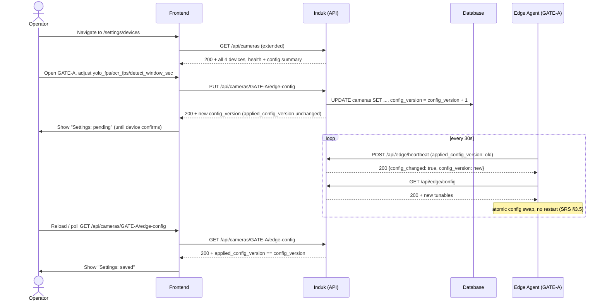

# System Logic: UC-008 Configure Edge Device Settings

**Version:** v1.0
**Status:** Draft — planned, not yet implemented
**Use Case:** UC-008
**Related User Flow:** `docs/user_flows/userflow_uc_008.md`
**Full spec:** `docs/edge-system/API_CONTRACT.md` §2.1–§2.2, `docs/edge-system/SRS.md` §5.3

> **Note on conventions:** unlike UC-001–UC-007, this endpoint follows the *real* backend's
> actual conventions (`/api` prefix, `snake_case`, `{"error": "..."}` on failure) as documented
> in `docs/edge-system/API_CONTRACT.md` §0 — not the `{"success", "data", "message"}` envelope
> used elsewhere in this document set, which describes a different, unimplemented system.

---

## 1. Sequence Diagram



---

## 2. API Contracts

Full field-level reference: `docs/edge-system/API_CONTRACT.md` §2.1 (`GET`) and §2.2 (`PUT`).
Summarized here for traceability only — the API_CONTRACT document is authoritative.

### 2.1 `GET /api/cameras/{camera_code}/edge-config`

**Success (200):**
```json
{
  "camera_code": "GATE-A",
  "yolo_fps": 20,
  "ocr_fps": 4,
  "detect_window_sec": 6,
  "ocr_min_conf": 0.30,
  "dedup_iou": 0.92,
  "config_version": 3,
  "device_status": "online",
  "agent_version": "1.0.0",
  "last_heartbeat_at": "2026-08-02T14:31:30Z",
  "last_config_applied_at": "2026-08-02T09:12:00Z",
  "applied_config_version": 3,
  "local_queue_depth": 0
}
```

**Not found (404):** `{"error": "Camera not found"}`

### 2.2 `PUT /api/cameras/{camera_code}/edge-config`

**Request** (partial update, all fields optional, at least one required):
```json
{ "yolo_fps": 22, "ocr_fps": 5, "detect_window_sec": 5 }
```

**Success (200):** same shape as §2.1, with updated values and `config_version` incremented by
exactly 1. `applied_config_version` is unchanged until the device's next heartbeat confirms it.

**Validation error (400):** `{"error": "yolo_fps must be between 1 and 30"}`

---

## 3. Security Rules

| Rule | Implementation |
| :--- | :--- |
| Only the device-configurable fields (`yolo_fps`, `ocr_fps`, `detect_window_sec`, `ocr_min_conf`, `dedup_iou`) are writable via this endpoint | Identity/registry fields (name, folder, `rtsp_url`, etc.) stay on the existing `PUT /api/cameras/{camera_code}` — never merged into this one. |
| Range validation is server-side, not just client-side | `docs/edge-system/API_CONTRACT.md` §2.2 table is authoritative; the frontend form (design_system.md §7.10) mirrors it but the server rejects out-of-range values regardless. |
| `api_key_hash` is never returned by this or any read endpoint | `docs/edge-system/SRS.md` §7.3 (Security NFR). |
