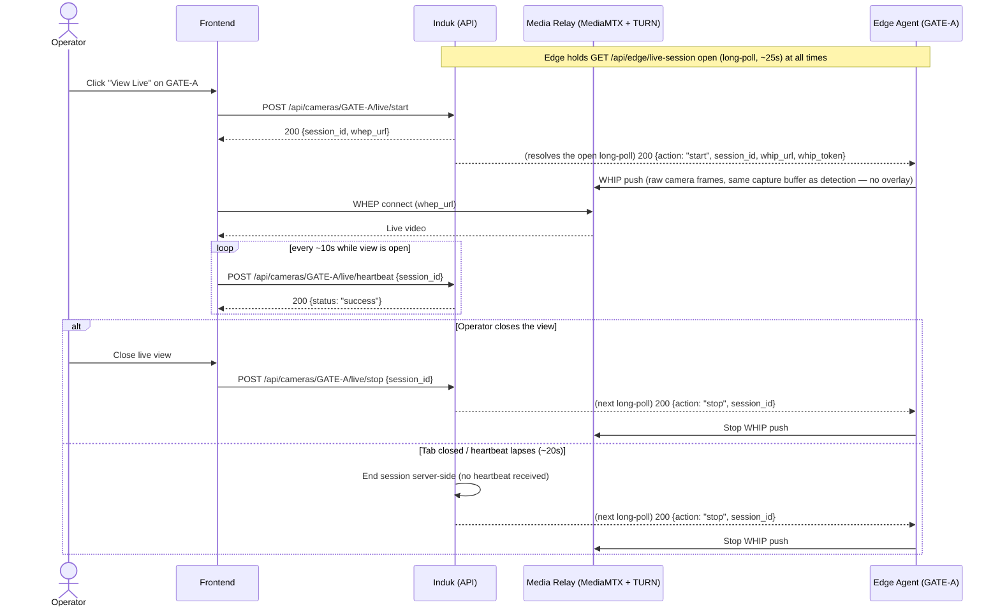

# System Logic: UC-009 View Live Raw CCTV Feed

**Version:** v1.0
**Status:** Draft — planned, not yet implemented
**Use Case:** UC-009
**Related User Flow:** `docs/user_flows/userflow_uc_009.md`
**Full spec:** `docs/edge-system/API_CONTRACT.md` §1.4, §2.4, `docs/edge-system/SRS.md` §8

> **Note on conventions:** see `docs/system_logics/sys_uc_008.md`'s header note — this document
> follows the real backend's actual conventions, not the fictional envelope used in UC-001–007.

---

## 1. Sequence Diagram



---

## 2. API Contracts

Full field-level reference: `docs/edge-system/API_CONTRACT.md` §1.4 (edge long-poll) and §2.4
(dashboard start/heartbeat/stop). Summarized here for traceability only.

### 2.1 `POST /api/cameras/{camera_code}/live/start`

**Success (200):**
```json
{
  "session_id": "b3f1c9d2-4a11-4e2a-9c3f-7d1e2a6b9f00",
  "whep_url": "https://relay.smartgate.example/whep/GATE-A/b3f1c9d2-..."
}
```
Calling this twice for the same `camera_code` while a session is already active returns the
**same** `session_id`/`whep_url` — not an error (`docs/edge-system/SRS.md` §8.3).

If the device is offline, this still returns `200` — video simply never starts. The frontend must
treat "no video within a few seconds" as "device unreachable," not retry this endpoint
(`docs/edge-system/API_CONTRACT.md` §2.4).

### 2.2 `POST /api/cameras/{camera_code}/live/heartbeat`

**Request:** `{ "session_id": "b3f1c9d2-..." }`
**Success (200):** `{ "status": "success" }`
**Not found (404):** unknown/already-ended `session_id`.

### 2.3 `POST /api/cameras/{camera_code}/live/stop`

**Request:** `{ "session_id": "b3f1c9d2-..." }`
**Success (200):** `{ "status": "success" }` — idempotent, stopping an already-ended session is
not an error.

---

## 3. Security Rules

| Rule | Implementation |
| :--- | :--- |
| WHIP/WHEP credentials are short-lived and single-use, scoped to one `session_id` | Never the long-lived device API key (`docs/edge-system/SRS.md` §6 Security NFR). |
| The live feed is raw camera output only | The edge never draws a detection overlay into this stream, and the induk never derives crossing data from it (`docs/edge-system/PRD.md` Non-Goal — this is the single most important rule of this use case). |
| One gate at a time per viewer, no global cap on concurrent gates | `docs/edge-system/SRS.md` §8.4 — up to 4 concurrent sessions across different operators/gates is expected and unrestricted. |
| A stale session (no heartbeat ~20s) is torn down automatically | Prevents an abandoned tab from leaving an edge streaming indefinitely (`docs/edge-system/SRS.md` §8.3). |
