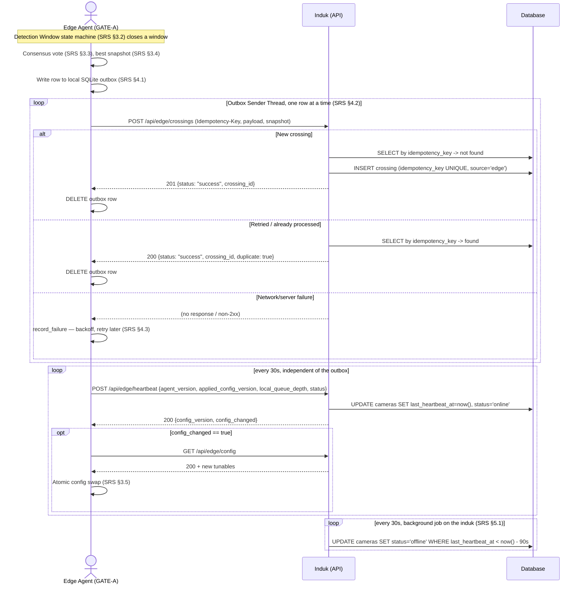

# System Logic: UC-010 Edge Device Reports Crossing & Heartbeat

**Version:** v1.0
**Status:** Draft — planned, not yet implemented
**Use Case:** UC-010
**Primary Actor:** Edge Agent (automated — not a human user; see `docs/user_flows/userflow_uc_010.md` for why this UC still gets a paired user-flow document)
**Full spec:** `docs/edge-system/SRS.md` §3–§5, `docs/edge-system/API_CONTRACT.md` §1

> **Note on conventions:** see `docs/system_logics/sys_uc_008.md`'s header note — this document
> follows the real backend's actual conventions, not the fictional envelope used in UC-001–007.

---

## 1. Sequence Diagram



---

## 2. API Contracts

Full field-level reference: `docs/edge-system/API_CONTRACT.md` §1.1–§1.3. Summarized here for
traceability only.

### 2.1 `POST /api/edge/crossings`

`multipart/form-data`, `Authorization: Bearer <device_api_key>`,
`Idempotency-Key: <UUID v4, stable across retries of the same crossing>`.

**`payload` field (JSON string) — key fields:**
```json
{
  "camera_code": "GATE-A",
  "detected_at": "2026-08-02T14:31:02Z",
  "window_sec": 5.8,
  "hull_id": "DT-118",
  "confidence": 0.94,
  "read_count": 9,
  "votes": [
    { "text": "DT-118", "count": 6, "avg_ocr_conf": 0.91 },
    { "text": "DT118",  "count": 2, "avg_ocr_conf": 0.85 },
    { "text": "DTI18",  "count": 1, "avg_ocr_conf": 0.62 }
  ]
}
```
`snapshot` file field is required unless `hull_id == "UNKNOWN"` and `read_count == 0`
(`docs/edge-system/SRS.md` §3.4).

**Success (201):** `{"status": "success", "crossing_id": 4821}`
**Duplicate (200):** `{"status": "success", "crossing_id": 4821, "duplicate": true}`

### 2.2 `POST /api/edge/heartbeat`

**Request:**
```json
{ "agent_version": "1.0.0", "applied_config_version": 3, "local_queue_depth": 0, "status": "online" }
```
**Success (200):** `{"status": "success", "config_version": 3, "config_changed": false}`

### 2.3 `GET /api/edge/config`

**Success (200):**
```json
{
  "camera_code": "GATE-A", "yolo_fps": 20, "ocr_fps": 4, "detect_window_sec": 6,
  "ocr_min_conf": 0.30, "dedup_iou": 0.92, "config_version": 3
}
```

---

## 3. Security Rules

| Rule | Implementation |
| :--- | :--- |
| Every `/api/edge/*` endpoint requires a valid, unrevoked per-device API key | `401 {"error": "Invalid device credentials"}` otherwise — `docs/edge-system/SRS.md` §7.3. |
| Duplicate crossing submissions never create duplicate rows | `idempotency_key UNIQUE` constraint at the DB level is the actual guard, not an application-level check-then-act (`docs/edge-system/SRS.md` §5.2). |
| A device's outbox never silently drops a crossing except via the explicit size-ceiling eviction | Every non-2xx response (including `401`/`422`) retries with backoff; the only discard path is logged loudly (`docs/edge-system/SRS.md` §4.3–§4.4). |
| Device `offline` status is inferred centrally, never self-reported | An agent's heartbeat `status` field only ever contains `"online"`/`"maintenance"` (`docs/edge-system/SRS.md` §5.1). |
