# OCR Smart Hauling & Ritase Monitoring Platform
## Comprehensive Feature & Operator Training Presentation

---

### Executive Overview & Training Scope

This presentation serves as an **Operator Training Manual** and complete feature guide for the **OCR Smart Hauling & Ritase Monitoring Platform**. It details all operational modules, interactive features, detail modals, live test run flows, and the built-in **Guide Mode** designed to assist operators in performing real-time monitoring, event reconciliation, video test processing, fleet management, and shift reporting.

---

## 1. Global Navigation & System Features

### Navigation & Notifications Overview
The platform features a modern dark-mode interface with a collapsible hierarchical sidebar and top utility header.

````carousel
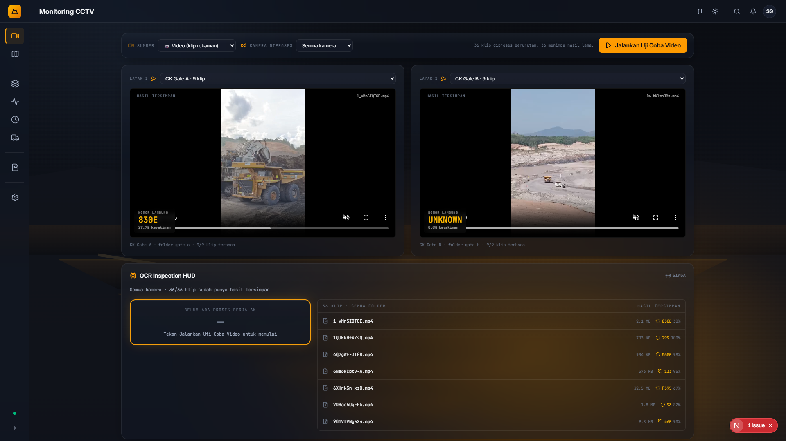
<!-- slide -->
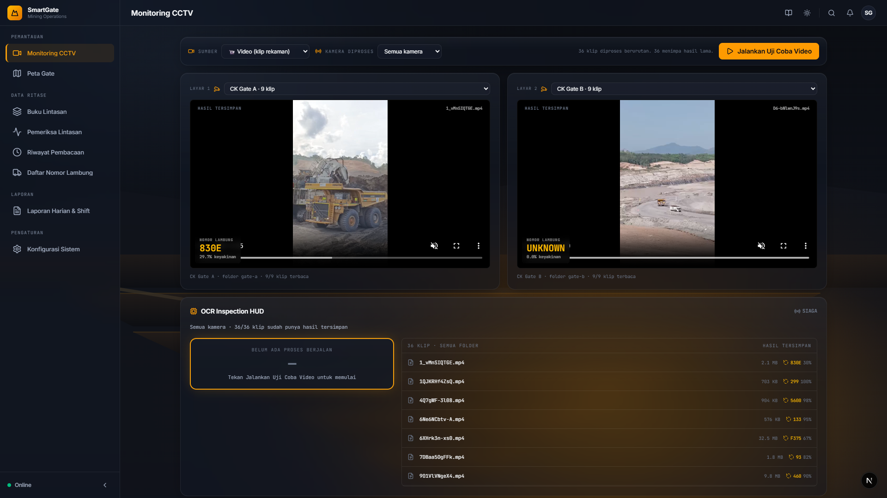
````

#### Key Capabilities & Operator Steps:
- **Grouped Sidebar Navigation**: Every page is a single click away, grouped under *Pemantauan*, *Data Ritase*, *Laporan*, and *Pengaturan* — no sub-menus to expand.
- **Notification Dropdown**: Click the bell icon in the top header to inspect real-time system alerts, unassigned vehicle warnings, and camera offline notifications.
- **Guide Mode Toggle**: Click the **"Guide Mode"** button in the top header anytime to turn interactive contextual help banners on or off across every screen.

---

## 2. Real-Time Monitoring Dashboard (`/`)

The core command center for viewing live camera streams, real-time vehicle detections, and active ritase statistics.

````carousel

<!-- slide -->
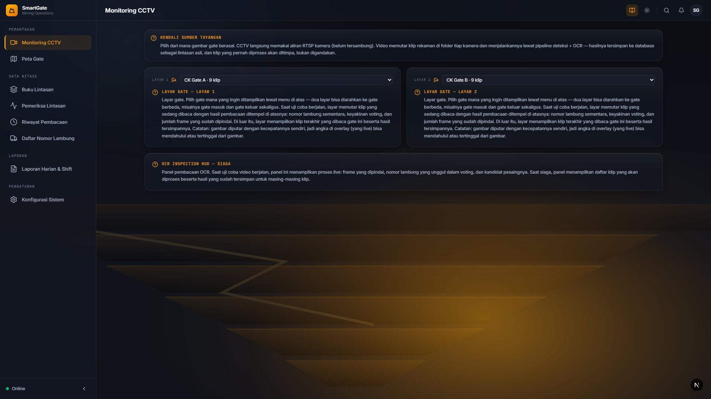
````

#### Detailed Feature Breakdown:
1. **Live Camera Feeds**: Multi-channel CCTV feeds showing real-time hauling gate crossings with active bounding boxes around truck license and hull numbers.
2. **Real-time Detection Feed**: Live stream of detected trucks showing Hull ID, OCR confidence percentage, gate location, and timestamp.
3. **KPI Summary Cards**: Instant status metrics displaying total daily trips, active fleet count, average OCR accuracy, and total estimated coal tonnage.
4. **Guide Mode Assistance**: When Guide Mode is enabled, amber banners highlight stream status indicators and provide step-by-step instructions for selecting individual camera channels.

---

## 3. Reconciliation Ledger (`/ledger`)

The central transaction registry linking entry gate events with exit gate events to form completed hauling cycles (ritase).

````carousel
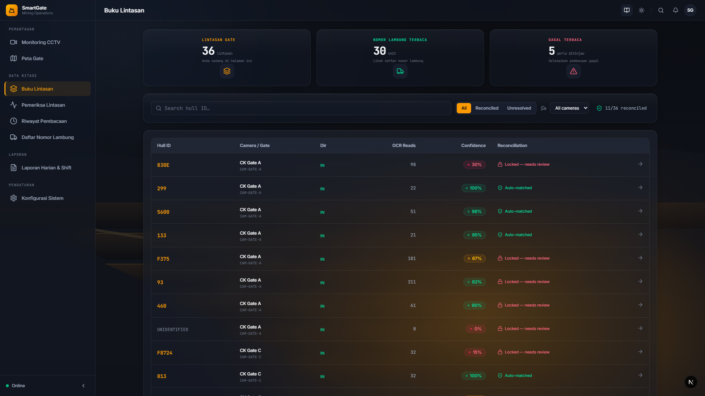
<!-- slide -->
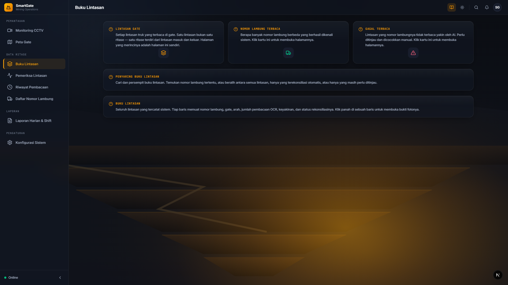
````

#### Detailed Feature Breakdown:
1. **Paired Ritase Records**: Displays matched entry/exit crossings with calculated duration, transit time, speed anomaly flags, and payload status.
2. **Filtering & Search Toolbar**: Search by Hull Number, filter by date range, shift, gate pair, or reconciliation status (Paired, Unmatched, Flagged).
3. **Guide Mode Assistance**: Highlights table headers and explains how reconciliation matching algorithm connects Gate IN and Gate OUT events.

---

## 4. Crossing Inspector & Event Detail View (`/crossing`)

Interactive inspection tool for analyzing individual crossing incidents, verifying OCR accuracy, and opening detailed evidence modals.

````carousel
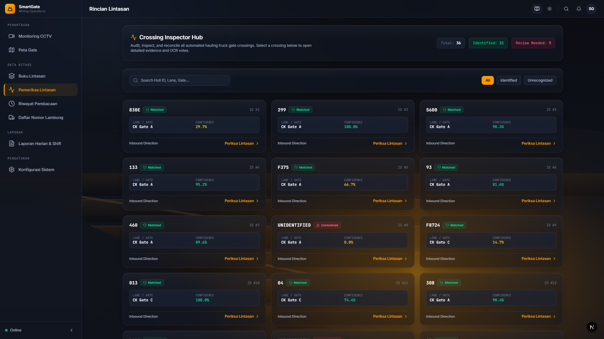
<!-- slide -->
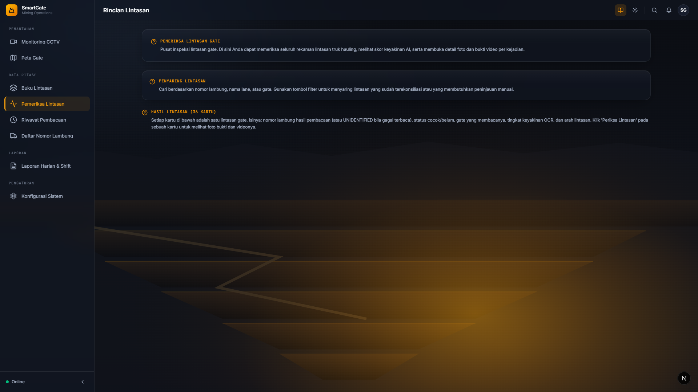
<!-- slide -->
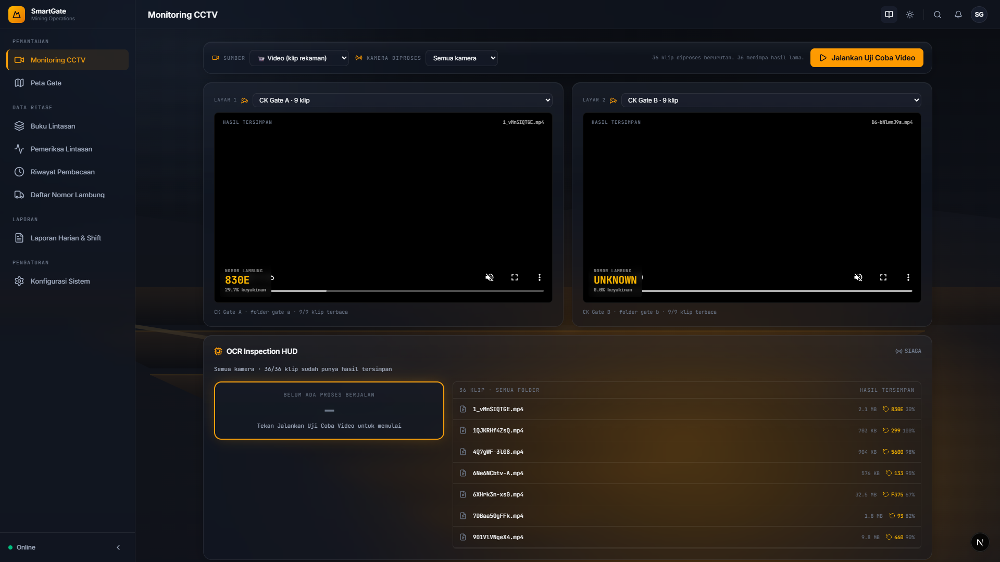
````

#### Detailed Feature Breakdown:
1. **Event Cards Grid**: Visual grid of recent crossings showing high-resolution camera snapshots, detected plate/hull numbers, and confidence ratings.
2. **Detail Modal (`07-crossing-detail-modal.png`)**: Clicking any crossing opens a full-screen inspector view:
   - High-zoom image inspection with bounding box overlays.
   - Raw OCR text extraction vs verified database record.
   - Manual override form allowing operators to correct misread hull numbers.
3. **Guide Mode Assistance**: Provides contextual guidance on how to verify ambiguous plate readings and perform manual reconciliation overrides.

---

## 5. CCTV History Archive & Video Player (`/cctv-history`)

Historical video footage lookup and playback system for auditing vehicle crossings and verifying dispute records.

````carousel
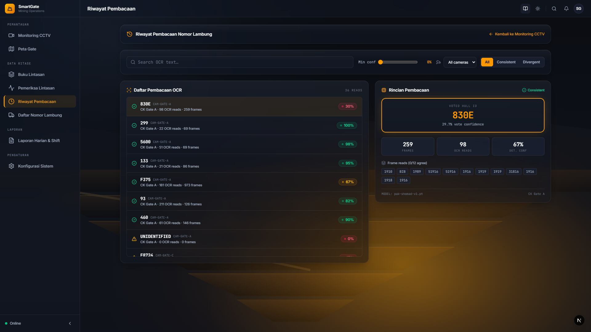
<!-- slide -->
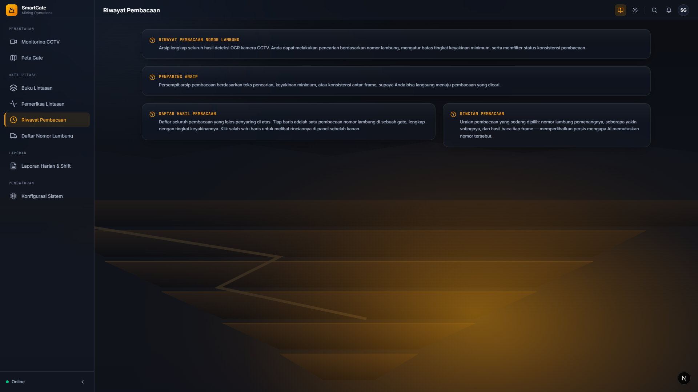
<!-- slide -->
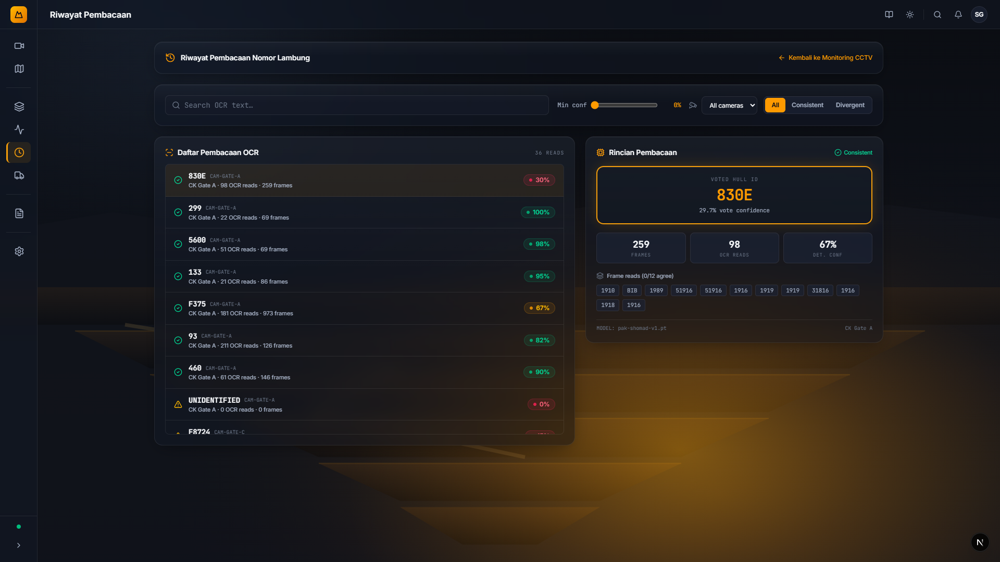
````

#### Detailed Feature Breakdown:
1. **Timeline & Query Controls**: Select camera channel, date, and hour to filter archived video clips.
2. **Video Player Modal (`10-cctv-player-modal.png`)**:
   - Integrated HTML5 video player with timestamp seek bar, play/pause, and playback speed controls.
   - Event metadata sidebar displaying vehicle entry time, duration, and associated OCR payload.
3. **Guide Mode Assistance**: Explains time-range search functions and video download capabilities for audit exports.

---

## 6. Fleet Registry & Asset Management (`/fleet`)

Comprehensive database of registered hauling trucks, contractor assignments, tare weights, and active operational status.

````carousel
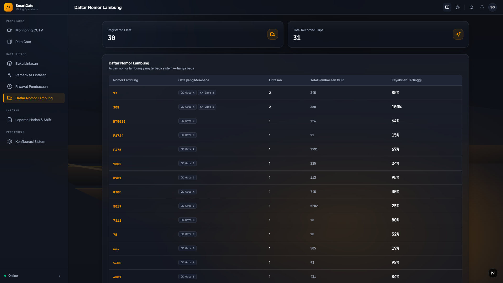
<!-- slide -->
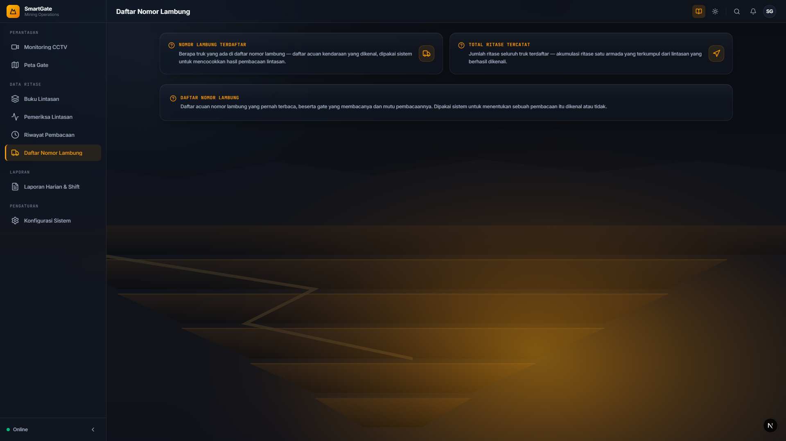
<!-- slide -->
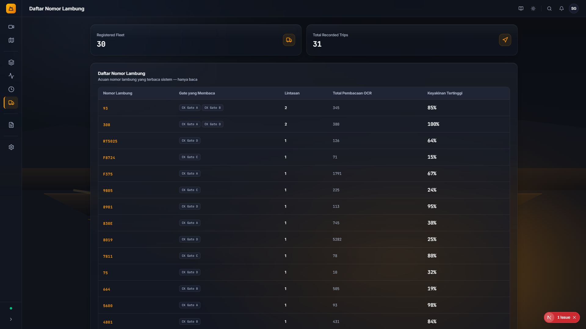
````

#### Detailed Feature Breakdown:
1. **Fleet Master Table**: Lists registered trucks with Hull ID, Contractor name, Capacity (Tons), Status (Active/Maintenance/Inactive), and total completed trips.
2. **Add Truck Modal (`13-fleet-add-truck-modal.png`)**: Form for registering new trucks into the OCR recognition whitelist with Hull ID, License Plate, Tare Weight, and Contractor assignment.
3. **Guide Mode Assistance**: Guides operators through registering new vehicles and updating vehicle maintenance status.

---

## 7. Gate Map & GIS Spatial View (`/map`)

Spatial map visualization displaying physical locations of hauling gates, CCTV camera positions, and active traffic flow.

````carousel
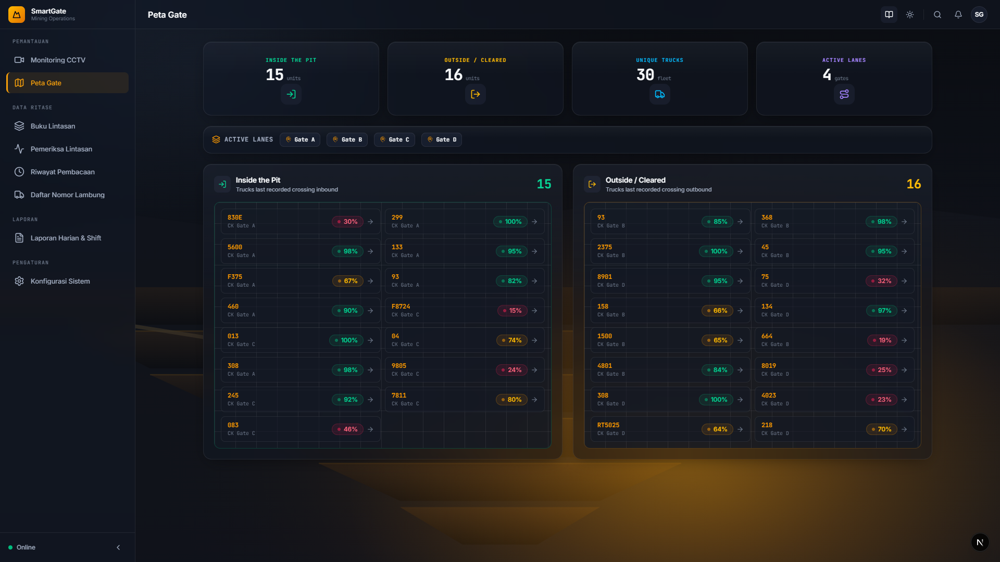
<!-- slide -->
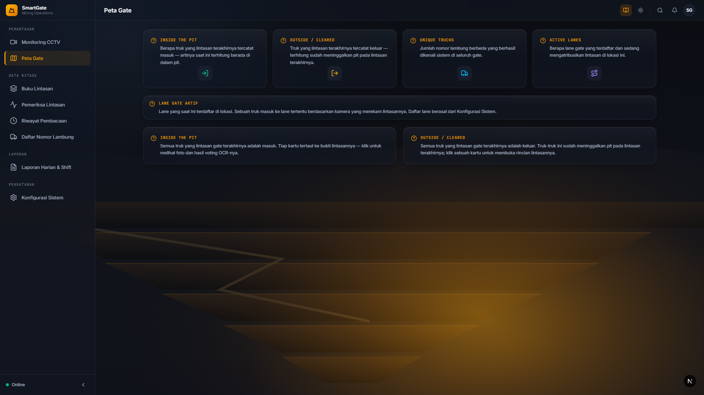
````

#### Detailed Feature Breakdown:
1. **Interactive GIS Map**: Topographical map showing Gate IN, Gate OUT, and Weighbridge locations across the hauling road network.
2. **Gate Status Pins**: Color-coded map markers indicating live camera status (Green = Online, Red = Offline, Amber = Warning).
3. **Guide Mode Assistance**: Explains map navigation controls, layer toggles, and gate telemetry overlays.

---

## 8. Daily & Shift Reporting Engine (`/reports`)

Automated reporting tool for generating shift summaries, lane breakdowns, and one-click PDF/CSV exports.

````carousel
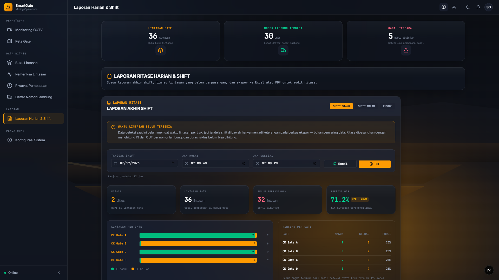
<!-- slide -->
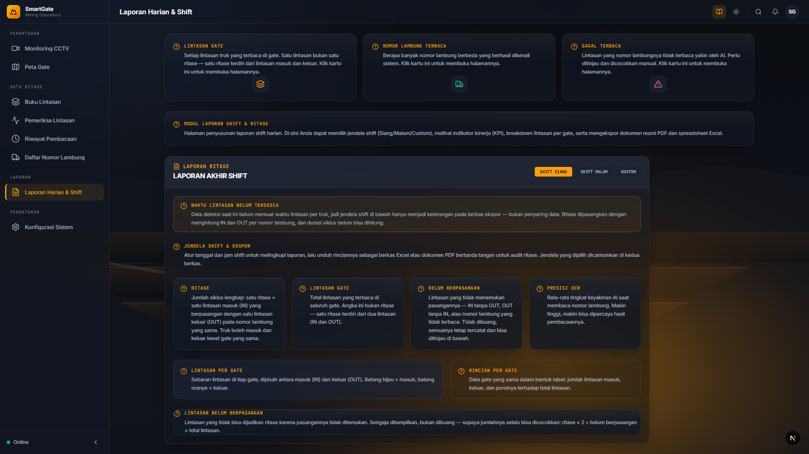
````

#### Detailed Feature Breakdown:
1. **Shift Window Controls**: Presets for Day Shift (07:00–19:00), Night Shift (19:00–07:00 with overnight date calculation), and Custom time windows.
2. **KPI & Lane Analytics**: Visual charts showing trip volume per lane, identified vs unknown vehicle ratios, and total estimated tonnage.
3. **One-Click Vector PDF Export**: Generates search-enabled, multi-page vector PDF reports complete with supervisor signature blocks and shift summary metrics.
4. **CSV Export**: Downloads RFC 4180 compliant CSV spreadsheet files with UTF-8 BOM encoding for direct Excel import.
5. **Guide Mode Assistance**: Highlights shift date picker controls and export button functions.

---

## 9. System Configuration & Settings (`/settings`)

Administrative control panel for managing camera RTSP/HTTP streams, OCR thresholds, and system integration parameters.

````carousel

<!-- slide -->
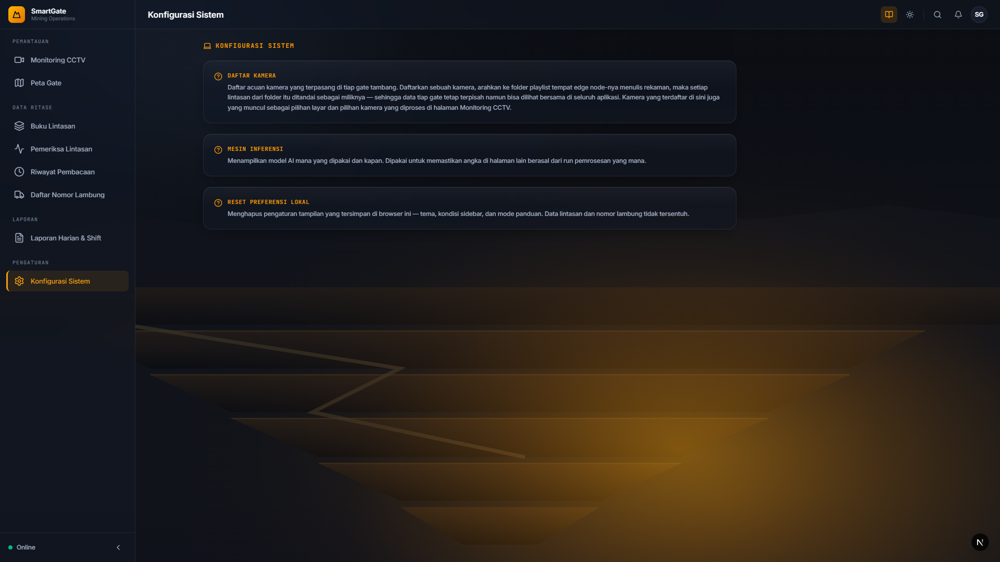
````

#### Detailed Feature Breakdown:
1. **Camera Registry & RTSP Settings**: Configure camera stream URLs, location labels, and frame rate capture settings.
2. **OCR Model Sensitivity**: Adjust confidence threshold sliders to control automatic matching vs manual review flags.
3. **Guide Mode Assistance**: Provides safety warnings and guidelines for adjusting system-wide confidence parameters.

---

## 10. Video Test Bench & Live Processing Run Flow (`/settings` & `/`)

An end-to-end operational pipeline allowing operators to run actual CCTV playlist video clips through the YOLOv8 + OCR detection engine and observe live, real-time voting progress.

````carousel
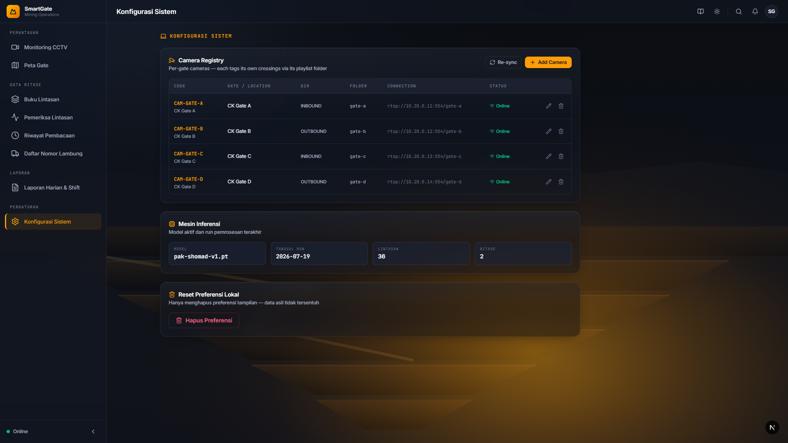
<!-- slide -->

<!-- slide -->
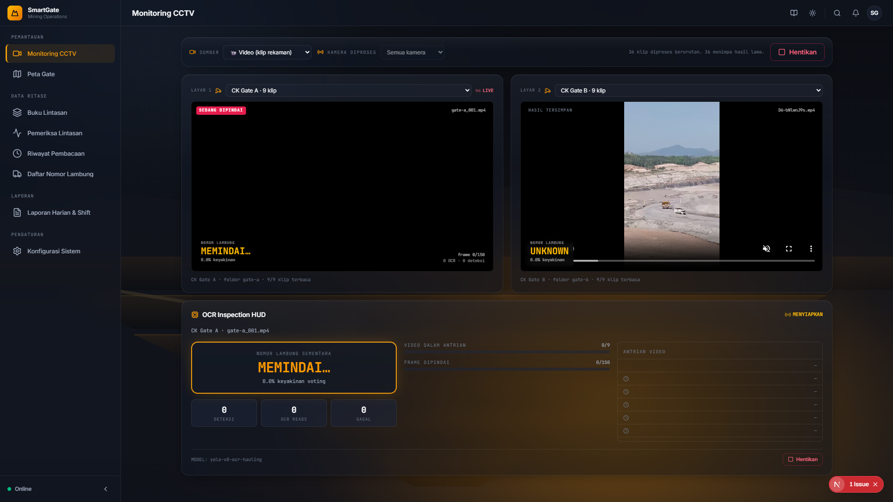
<!-- slide -->
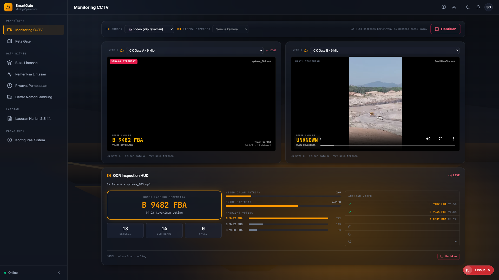
<!-- slide -->
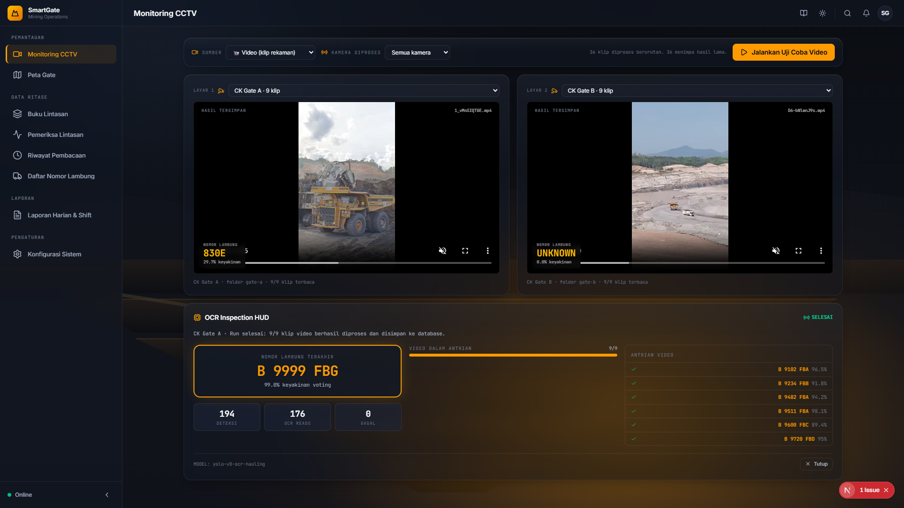
<!-- slide -->
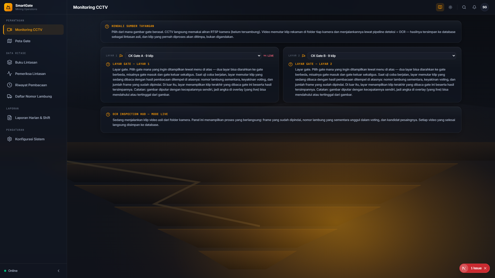
````

#### Detailed Step-by-Step Flow Breakdown:

1. **Step 1: Test Bench Camera & Clip Selection (`21-test-bench-settings-standard.png`)**
   - Located on the **System Configuration (`/settings`)** page.
   - Operators can select a specific gate camera (e.g. *CK Gate A*, *CK Gate B*) or select **ALL** cameras.
   - Displays real-time playlist clip count (e.g., 9 clips per camera folder) and indicates which clips have been previously processed or will be overwritten.

2. **Step 2: Interactive Guide Mode for Test Bench (`22-test-bench-settings-guidemode.png`)**
   - Activating Guide Mode highlights the video test bench panel and explains how clips are queued sequentially and written to the database.

3. **Step 3: Run Initialization & Queueing (`23-live-run-01-started-queued.png`)**
   - Clicking **"Jalankan & Pantau di HUD"** automatically initializes the background processing job and redirects the operator to the **Monitoring Dashboard (`/`)**.
   - The **OCR Inspection HUD** switches into **Live Mode (`MENYIAPKAN`)**, showing the total video queue (0/9), initial frame progress, and starting status.

4. **Step 4: Active Frame Scanning & Candidate Voting Distribution (`24-live-run-02-scanning-progress.png`)**
   - As the pipeline scans video clips frame-by-frame (`LIVE`), the HUD displays:
     - **Video Queue Progress**: Active clip index and total queue bar.
     - **Frame Scan Bar**: Real-time frame progress (e.g., Frame 94 / 150).
     - **Temporary Voted Hull ID**: Highest-confidence winning hull number updated live (e.g., `B 9482 FBA` at `94.2%` vote confidence).
     - **Candidate Voting Bars**: Relative vote share distribution across top competing hull ID candidates.
     - **Live Processing Queue Table**: Shows finished clips with recognized hull numbers, the active clip currently being scanned, and upcoming queued clips.

5. **Step 5: Run Completion & Results Summary (`25-live-run-03-completed.png`)**
   - Upon completing all clips (9/9), the HUD status transitions to **`SELESAI`**.
   - Shows summary totals for processed detections, successful OCR reads, and failed clips.
   - All recognized crossings are permanently committed to the database and reflected in the Reconciliation Ledger.

6. **Step 6: Live Run Guide Mode Overlay (`26-live-run-guidemode.png`)**
   - Toggling Guide Mode while a live processing run is active renders an amber contextual help banner explaining each metric, vote candidate bar, and queue control.

---

### Complete Summary Matrix of Screenshots (26 Total)

| # | Filename | Module / View | Guide Mode | Description |
|---|---|---|---|---|
| 01 | `01-dashboard-standard.png` | Dashboard (`/`) | OFF | Live monitoring & camera grid |
| 02 | `02-dashboard-guidemode.png` | Dashboard (`/`) | ON | Dashboard with guide mode banners |
| 03 | `03-ledger-standard.png` | Ledger (`/ledger`) | OFF | Reconciliation ledger table |
| 04 | `04-ledger-guidemode.png` | Ledger (`/ledger`) | ON | Reconciliation ledger with guide notes |
| 05 | `05-crossing-standard.png` | Crossing (`/crossing`) | OFF | Crossing inspector card grid |
| 06 | `06-crossing-guidemode.png` | Crossing (`/crossing`) | ON | Crossing inspector with guide notes |
| 07 | `07-crossing-detail-modal.png` | Detail Modal | OFF | High-res image & OCR override inspector |
| 08 | `08-cctv-history-standard.png` | CCTV History (`/cctv-history`) | OFF | CCTV archive clip browser |
| 09 | `09-cctv-history-guidemode.png` | CCTV History (`/cctv-history`) | ON | CCTV archive with guide mode |
| 10 | `10-cctv-player-modal.png` | Detail Modal | OFF | Video player modal with seek controls |
| 11 | `11-fleet-standard.png` | Fleet (`/fleet`) | OFF | Fleet registry table & stats |
| 12 | `12-fleet-guidemode.png` | Fleet (`/fleet`) | ON | Fleet registry with guide mode |
| 13 | `13-fleet-add-truck-modal.png` | Detail Modal | OFF | Add new truck registration form |
| 14 | `14-map-standard.png` | Gate Map (`/map`) | OFF | Interactive gate map view |
| 15 | `15-map-guidemode.png` | Gate Map (`/map`) | ON | Gate map with guide mode overlays |
| 16 | `16-reports-standard.png` | Reports (`/reports`) | OFF | Shift window & report generator |
| 17 | `17-reports-guidemode.png` | Reports (`/reports`) | ON | Reports screen with guide mode |
| 18 | `18-settings-standard.png` | Settings (`/settings`) | OFF | Camera registry & OCR config |
| 19 | `19-settings-guidemode.png` | Settings (`/settings`) | ON | Settings screen with guide mode |
| 20 | `20-notifications-dropdown.png` | Top Header | OFF | Header notifications dropdown menu |
| 21 | `21-test-bench-settings-standard.png` | Settings (`/settings`) | OFF | Video Test Bench camera & clip selection |
| 22 | `22-test-bench-settings-guidemode.png` | Settings (`/settings`) | ON | Video Test Bench with guide mode note |
| 23 | `23-live-run-01-started-queued.png` | Live Run HUD (`/`) | OFF | Processing run starting & queued state |
| 24 | `24-live-run-02-scanning-progress.png` | Live Run HUD (`/`) | OFF | Active scanning, candidate votes & live queue |
| 25 | `25-live-run-03-completed.png` | Live Run HUD (`/`) | OFF | Completed processing run summary |
| 26 | `26-live-run-guidemode.png` | Live Run HUD (`/`) | ON | Live Run HUD with guide mode assistance |

---
