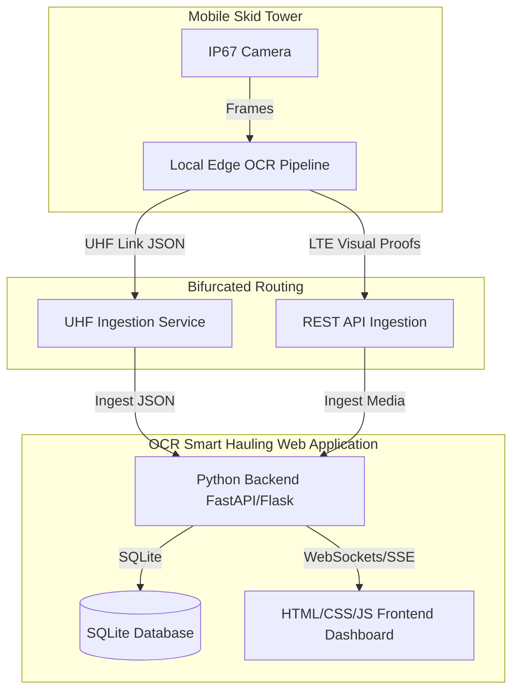

# Smart Gate: Implementation & Enhancement Plan

This document outlines the system architecture, implementation history, and active enhancement tasks for the Smart Gate (Integrated Smart Hauling System - ISHS) platform in alignment with the PRD.

---

## 1. Platform Structure & Architecture

The Smart Gate platform is designed as an edge-computing-first system with dual-telemetry redundancy, centered around a unified Web Application:

---

## 2. Platform History & Current Status

* **Status:** Phase 10 Plan Initialized.
* **Completed Roadmap Tasks:**
  - **1.16 - 1.18**: Database vacuum manager, Edge tower notification mailer, Vehicle classification distribution summary API.
  - **2.16 - 2.18**: Timeline chart legends filter, Supervisor settings drawer, Visual search term history dropdown.
  - **3.16 - 3.18**: Multi-sheet Excel reconciliation exporter, Customizable telemetry alert thresholds modal, Dashboard grid density scale slider.
  - **1.19 - 1.21**: Historical telemetry data purge API, OCR confidence calibration settings API, Mock edge telemetry stream simulator.
  - **2.19 - 2.21**: Visual alert notification flash banner, Database optimize task loader indicator, Visual filter reset button in crossing feed.
  - **3.19 - 3.21**: Telemetry battery and solar correlation chart, Supervisor shift hand-over note log, Visual color-coded map view style switcher.
  - **1.22 - 1.24**: Contractor target compliance alert API, Database automatic backup cron service, Telemetry signal quality estimator.
  - **2.22 - 2.24**: Interactive contractor warning dispatcher form, Collapsible theater mode view for visual audits, Visual contractor target compliance chart.
  - **3.22 - 3.24**: Shift distribution bar chart, Subcontractor performance comparison chart, Subcontractor compliance timeline.
  - **1.25 - 1.27**: Latency watchdog service API, Database automated compression integrity checker, Automated vehicle shift load warning service.
  - **2.25 - 2.27**: Crossing feed direction filter checkboxes, Database backup drawer download list, Telemetry SNR signal bars on map markers.
  - **3.25 - 3.27**: Contractor efficiency heat grid matrix, Cycle duration outlier scatter plot, Real-time subcontractor compliance summary widget.
  - **1.28 - 1.30**: Daily battery drain diagnostic, subcontractor email summary scheduler, database index performance advisor.
  - **2.28 - 2.30**: Mobile responsive dashboard toggle, interactive onboarding popup guide, live audio warning speech synthesizer.
  - **3.28 - 3.30**: Compliance timeline anomaly alert, subcontractor cycle speed variance chart, real-time target forecast predictions.
  - **1.31 - 1.33**: Telemetry multi-sensor anomaly detection service, geo-fencing route violation detection, backup FIFO rotation auto-cleaner.
  - **2.31 - 2.33**: Visual route replay overlay, database restore progress bar, cyberpunk/light/dark theme toggle.
  - **3.31 - 3.33**: Target forecast deviation alert banner, dispatch discrepancy heat grid, PDF report custom branding designer.
  - **1.34 - 1.36**: DB integrity check cron service, API rate limiter, contractor payload estimation endpoint.
  - **2.34 - 2.36**: Undo/redo toast notifier, grid config drawer, database backups visual timeline.
  - **3.34 - 3.36**: Contractor target deviation chart, digital signature verification, dispatch efficiency leaderboard.
  - **1.37 - 1.39**: Contractor cycle duration alert, database query TTL cache middleware, automated shift-end email report distribution scheduler.
  - **2.37 - 2.39**: Database backup growth/storage statistics widget, live gate lane camera stream simulation panel, interactive discrepancy classification filter pills.
  - **3.37 - 3.39**: Contractor fleet capacity 12-hour forecast line chart, real-time PDF print preview layout settings sidebar, leaderboard 12-hour rank sparkline timeline.

---

## 3. Active Enhancement Tasks List
 
### Section 1: Web Application Backend (Python)
 
* **1.40** Implement automated database schema migration manager: Build an endpoint to verify database schema version and apply migration scripts programmatically.
  * **Status:** `[DONE]`
* **1.41** Implement API payload compression middleware: Integrate Gzip compression for all JSON payloads over 10KB to optimize bandwidth usage.
  * **Status:** `[DONE]`
* **1.42** Build a system load monitoring endpoint: Expose a `/system/health` endpoint returning server CPU, RAM, disk utilization, and DB file size metrics.
  * **Status:** `[DONE]`
 
### Section 2: Web Application Frontend
 
* **2.40** Create a telemetry status notification sound manager: Toggle customized beep tones for low battery, charging failures, and offline skid towers.
  * **Status:** `[DONE]`
* **2.41** Build interactive map zone highlights: Animate map loading/dumping circles when new crossings are registered on associated lanes.
  * **Status:** `[DONE]`
* **2.42** Build custom metric threshold control sliders in settings: Enable operators to dynamically edit critical boundaries for battery, solar, and latency directly from the settings drawer.
  * **Status:** `[TODO]`
 
### Section 3: Ingestion & Reporting Dashboard Features
 
* **3.40** Create a fleet utility heatmap visualizer: Render a 2D grid matrix mapping active trucks against hour-of-shift to visualize fleet utilization density.
  * **Status:** `[TODO]`
* **3.41** Build interactive reports export scheduling wizard: Provide a modal form enabling operators to customize and schedule automated report dispatches.
  * **Status:** `[TODO]`
* **3.42** Build discrepancy audit resolution workflow action forms: Expose inline form buttons for operators to resolve discrepancy records with custom notes.
  * **Status:** `[TODO]`
