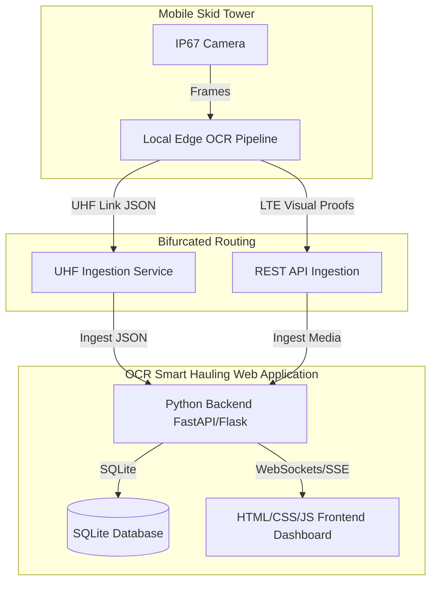

# Smart Gate: Implementation & Enhancement Plan

This document outlines the system architecture, implementation history, and active enhancement tasks for the Smart Gate (Integrated Smart Hauling System - ISHS) platform in alignment with the [PRD.md](../docs/PRD.md).

---

## 1. Platform Structure & Architecture

The Smart Gate platform is designed as an edge-computing-first system with dual-telemetry redundancy, centered around a unified Web Application:

---

## 2. Platform History & Current Status

* **Status:** Prototype & Experimental phase.
* **Labs Progress:**
  - `01-download-playlist.py`: Utility to download source OHT haulage video playlist.
  - `02-extract-videos.py`: Frame-extraction utility to sample 8 frames per video.
  - `03-extract-truck-id.py`: Prototype segmenting truck hull number regions using Segment Anything Model (SAM 3).
  - `04-ocr-truck-id-using-paddle-ocr-vl-1.6.py`: Local OCR testing with PaddleOCR.
  - `05-ocr-truck-id-using-nvidia-nemotron-ocr-2.py`: Remote/local OCR testing using NVIDIA Nemotron OCR-v2.
  - `06-extract-video-using-sam3-and-ocr.py`: Integrated end-to-end pipeline with SAM3 + PaddleOCR.
  - `07-extract-video-using-sam3-and-ocr-using-nvidia-nemotron-ocr-v2.py`: Subprocess-based end-to-end pipeline utilizing Nemotron OCR-v2.

---

## 3. Active Enhancement Tasks List

### Section 1: Web Application Backend (Python)

* **1.1** Build Python Backend Server (FastAPI or Flask) utilizing SQLite as the system database to handle API requests, authenticate users, and manage the fleet registry and crossing database.
  * **Status:** `[DONE]`
* **1.2** Develop OCR Video Processing API endpoint to accept hauling video uploads, run the edge OCR extraction pipeline, and store predictions and visual proof metadata in the SQLite database.
  * **Status:** `[DONE]`
* **1.3** Wrap the entire web application inside Docker Compose, configuring containerized services for the Python backend and web frontend, and mounting persistent docker volumes for SQLite database storage and visual evidence logs.
  * **Status:** `[DONE]`
* **1.4** Implement Fuzzy Logic OCR Matching using `rapidfuzz` on the backend to resolve character segmentation and spelling errors by comparing extracted OCR hull IDs against the registered master OHT fleet.
  * **Status:** `[DONE]`

### Section 2: Web Application Frontend

* **2.1** Initialize Dashboard User Interface using HTML, Vanilla CSS for premium styling, and JavaScript for live interaction.
  * **Status:** `[DONE]`
* **2.2** Implement Real-time Live Crossing Feed (right-side panel) displaying a list of detected trucks with the most recent on top once confidence is reached. Each list item must contain the captured frame, truck number crop, OCR result, date/time, and confidence score.
  * **Status:** `[DONE]`
* **2.3** Create Split-Pane Layout (left-side panel) on the frontend displaying front and rear camera feeds side-by-side, integrated with the crossing list to allow users to click any crossing row to display its detailed visual proofs (crop comparisons and context frames) and metadata.
  * **Status:** `[DONE]`

### Section 3: Ingestion & Reporting Dashboard Features

* **3.1** Build Shift Summary & Reporting Engine in Python to auto-identify the inbound/outbound direction of trucks and compute/display haulage statistics (completed ritase, total crossings, per truck, per date, and per 4-hour shifts) and identify subcontractor discrepancies.
  * **Status:** `[DONE]`
* **3.2** Implement Data Reconciliation, CSV/PDF Export, and Sync Mockup to allow users to filter, search, export crossing sheets, and trigger a manual synchronization status indicator to a mockup central dashboard system.
  * **Status:** `[TODO]`
* **3.3** Add Remote Tower Status & Telemetry Panel to display battery levels, solar array output, and connection latency for the deployed mobile skid towers.
  * **Status:** `[TODO]`
