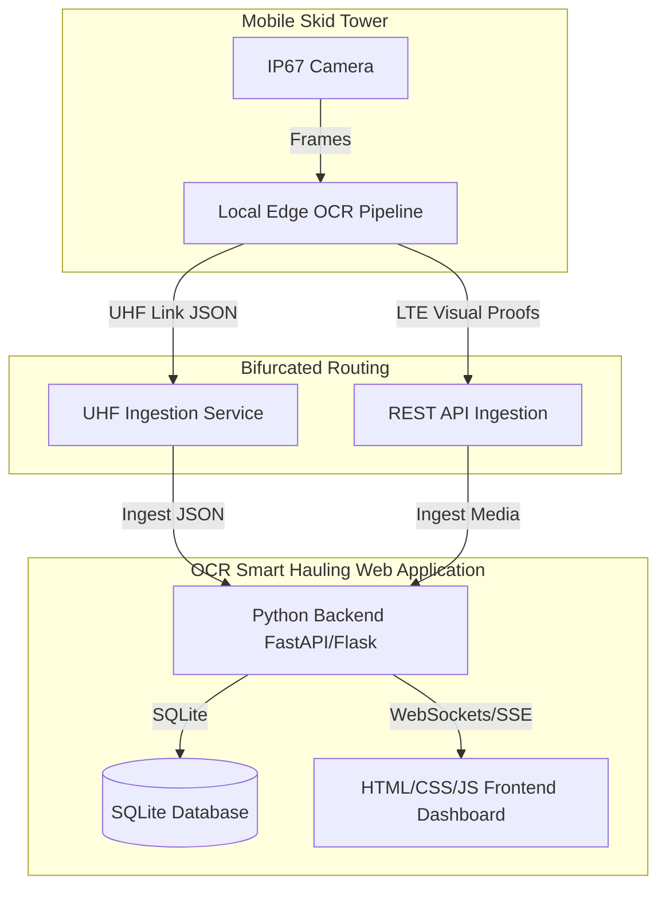

# Smart Gate: Implementation & Enhancement Plan

This document outlines the system architecture, implementation history, and active enhancement tasks for the Smart Gate (Integrated Smart Hauling System - ISHS) platform in alignment with the PRD.

---

## 1. Platform Structure & Architecture

The Smart Gate platform is designed as an edge-computing-first system with dual-telemetry redundancy, centered around a unified Web Application:

---

## 2. Platform History & Current Status

* **Status:** Phase 3 Core Capabilities Completed.
* **Labs Progress:**
  - `01-download-playlist.py`: Utility to download source OHT haulage video playlist.
  - `02-extract-videos.py`: Frame-extraction utility to sample 8 frames per video.
  - `03-extract-truck-id.py`: Prototype segmenting truck hull number regions using SAM 3.
  - `04-ocr-truck-id-using-paddle-ocr-vl-1.6.py`: Local OCR testing with PaddleOCR.
  - `05-ocr-truck-id-using-nvidia-nemotron-ocr-2.py`: Remote/local OCR testing using NVIDIA Nemotron OCR-v2.
  - `06-extract-video-using-sam3-and-ocr.py`: Integrated end-to-end pipeline with SAM3 + PaddleOCR.
  - `07-extract-video-using-sam3-and-ocr-using-nvidia-nemotron-ocr-v2.py`: Subprocess-based end-to-end pipeline utilizing Nemotron OCR-v2.
* **Completed Roadmap Tasks:**
  - **1.1 - 1.4**: SQLite Backend, SAM3 Ingestion OCR endpoint, Docker Compose wrapping, and RapidFuzz fuzzy fleet match.
  - **2.1 - 2.3**: Vanilla CSS Operations Dashboard, WebSocket live feed list, and Split-pane comparison visual audit frames.
  - **3.1 - 3.3**: Ritase shift calculator, CSV reconciliation/cloud sync buttons, and real-time remote gate telemetry status bars.

---

## 3. Active Enhancement Tasks List

### Section 1: Web Application Backend (Python)

* **1.7** Implement automatic database backups scheduler: Add a background thread/task inside the FastAPI backend that executes a SQLite backup once every 24 hours and saves it to the `data/backups/` directory.
  * **Status:** `[DONE]`
* **1.8** Implement a JSON export REST API endpoint for audit trails: Add `GET /api/admin/audit-logs/export` returning the chronological supervisor action logs in JSON format with query filtering for external compliance reporting.
  * **Status:** `[DONE]`
* **1.9** Implement dynamic remote tower latency alert triggers: Automatically generate warning logs if a skid tower latency exceeds 400ms across 3 consecutive status polls.
  * **Status:** `[DONE]`

### Section 2: Web Application Frontend

* **2.7** Add interactive grid layout toggle button: Add a toggle selector in the Dashboard tab header to switch between a standard listing view and a high-density, multi-column grid layout for the crossing feed.
  * **Status:** `[TODO]`
* **2.8** Add inline manual registration action inside Feed items: Add a small "Add to Fleet" button directly inside the list cards of any "Unregistered OHT Crossing" to instantly open the registration modal pre-filled with the unregistered vehicle's detected Hull ID.
  * **Status:** `[TODO]`
* **2.9** Implement real-time audio status toggle: Add a speaker mute/unmute button next to the WS indicator in the dashboard header to allow supervisors to enable/disable sound alerts during live operations.
  * **Status:** `[TODO]`

### Section 3: Ingestion & Reporting Dashboard Features

* **3.7** Implement an automated HTML report export button: Add a button inside the reports tab to download a standalone, styles-embedded HTML file of the current report tab's state for offline auditing.
  * **Status:** `[TODO]`
* **3.8** Add contractor expected hourly capacity target settings: Expose expected capacity rates configuration in the targets dialog box to calculate and display target compliances dynamically based on the customized expectations.
  * **Status:** `[TODO]`
* **3.9** Implement automatic chart printing styles toggle: Automatically hide the print modal parameters inputs when browser print operations are cancelled or completed, restoring the original state of interactive modal indicators.
  * **Status:** `[TODO]`

