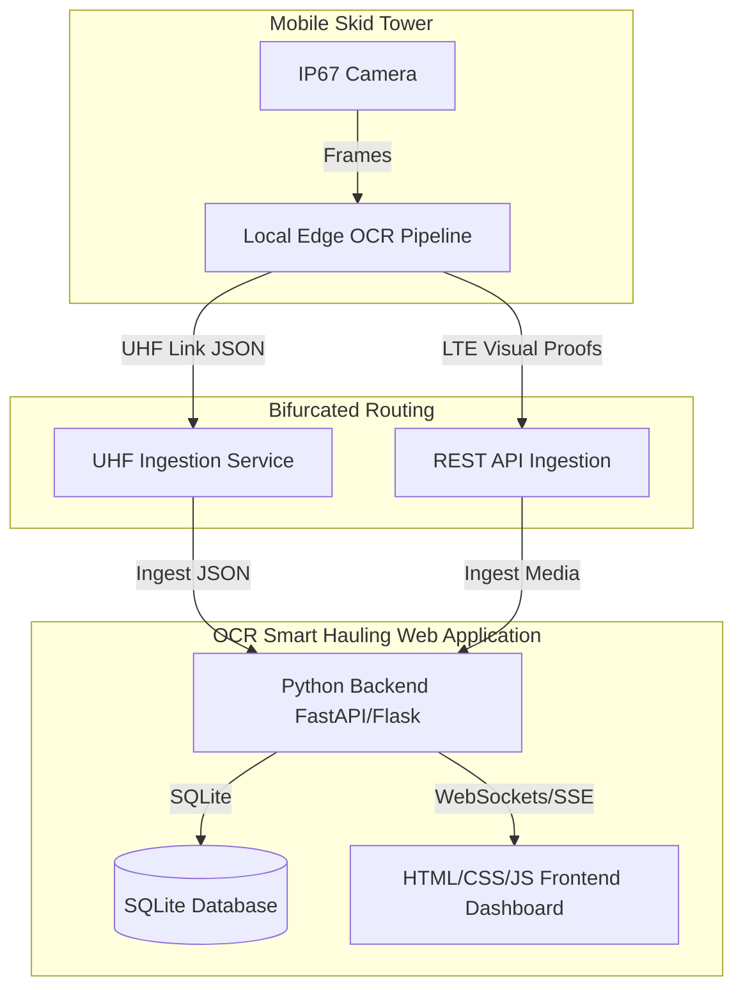

# Smart Gate: Implementation & Enhancement Plan

This document outlines the system architecture, implementation history, and active enhancement tasks for the Smart Gate (Integrated Smart Hauling System - ISHS) platform in alignment with the PRD.

---

## 1. Platform Structure & Architecture

The Smart Gate platform is designed as an edge-computing-first system with dual-telemetry redundancy, centered around a unified Web Application:

---

## 2. Platform History & Current Status

* **Status:** Phase 7 Plan Initialized.
* **Completed Roadmap Tasks:**
  - **1.16 - 1.18**: Database vacuum manager, Edge tower notification mailer, Vehicle classification distribution summary API.
  - **2.16 - 2.18**: Timeline chart legends filter, Supervisor settings drawer, Visual search term history dropdown.
  - **3.16 - 3.18**: Multi-sheet Excel reconciliation exporter, Customizable telemetry alert thresholds modal, Dashboard grid density scale slider.
  - **1.19 - 1.21**: Historical telemetry data purge API, OCR confidence calibration settings API, Mock edge telemetry stream simulator.
  - **2.19 - 2.21**: Visual alert notification flash banner, Database optimize task loader indicator, Visual filter reset button in crossing feed.
  - **3.19 - 3.21**: Telemetry battery and solar correlation chart, Supervisor shift hand-over note log, Visual color-coded map view style switcher.
  - **1.22 - 1.24**: Contractor target compliance alert API, Database automatic backup cron service, Telemetry signal quality estimator.
  - **2.22 - 2.24**: Interactive contractor warning dispatcher form, Collapsible theater mode view for visual audits, Visual contractor target compliance chart.
  - **3.22 - 3.24**: Shift distribution bar chart, Subcontractor performance comparison chart, Subcontractor compliance timeline.
  - **1.25 - 1.27**: Latency watchdog service API, Database automated compression integrity checker, Automated vehicle shift load warning service.
  - **2.25 - 2.27**: Crossing feed direction filter checkboxes, Database backup drawer download list, Telemetry SNR signal bars on map markers.
  - **3.25 - 3.27**: Contractor efficiency heat grid matrix, Cycle duration outlier scatter plot, Real-time subcontractor compliance summary widget.
  - **1.28 - 1.30**: Daily battery drain diagnostic, subcontractor email summary scheduler, database index performance advisor.
  - **2.28 - 2.30**: Mobile responsive dashboard toggle, interactive onboarding popup guide, live audio warning speech synthesizer.
  - **3.28 - 3.30**: Compliance timeline anomaly alert, subcontractor cycle speed variance chart, real-time target forecast predictions.

---

## 3. Active Enhancement Tasks List
 
### Section 1: Web Application Backend (Python)
 
* **1.31** Build an automated telemetry multi-sensor anomaly detection service: Expose a GET route `/api/admin/telemetry/anomalies` that correlates solar array charging drops with battery depletion patterns, logging event classifications to the audit trail.
  * **Status:** `[DONE]`
* **1.32** Implement a subcontractor geo-fencing route violation detection service: Analyze transit times between checkpoints and flag OHT vehicles whose segment times deviate significantly from physical boundaries, indicating shortcuts.
  * **Status:** `[DONE]`
* **1.33** Implement a database backup FIFO rotation auto-cleaner: Build a disk space watchdog task that tracks backing files and automatically prunes database backups older than 7 days to preserve storage limit safety.
  * **Status:** `[TODO]`
 
### Section 2: Web Application Frontend
 
* **2.31** Build an interactive visual route replay overlay on the map view: Render animated path lines on the SVG checkpoint map when hovering over any live feed card to show the vehicle's direction and sequence history.
  * **Status:** `[TODO]`
* **2.32** Add a live visual database restore task progress bar: Render a real-time progress bar in the database backup drawer showing the progress of decompression and restoration using Server-Sent Events.
  * **Status:** `[TODO]`
* **2.33** Add an interactive visual light/dark/neon cyberpunk theme toggle: Include a theme selection switch that switches dashboard colors, shadows, and neon glow settings dynamically, saving preferences to `localStorage`.
  * **Status:** `[TODO]`
 
### Section 3: Ingestion & Reporting Dashboard Features
 
* **3.31** Build a real-time subcontractor target forecast deviation alert banner: Display a prominent warning banner at the top of the dashboard if a contractor's projected shift ritase drops below 75% of target limits.
  * **Status:** `[TODO]`
* **3.32** Implement an interactive subcontractor dispatch discrepancy heat grid: Renders a matrix visual comparing count of active shift fleet vehicles against completed ritase to identify contractor utilization issues.
  * **Status:** `[TODO]`
* **3.33** Implement a PDF report download custom branding designer: Expose input controls allowing supervisors to specify custom client names and logo image URLs to dynamically render in printed shift report summaries.
  * **Status:** `[TODO]`
