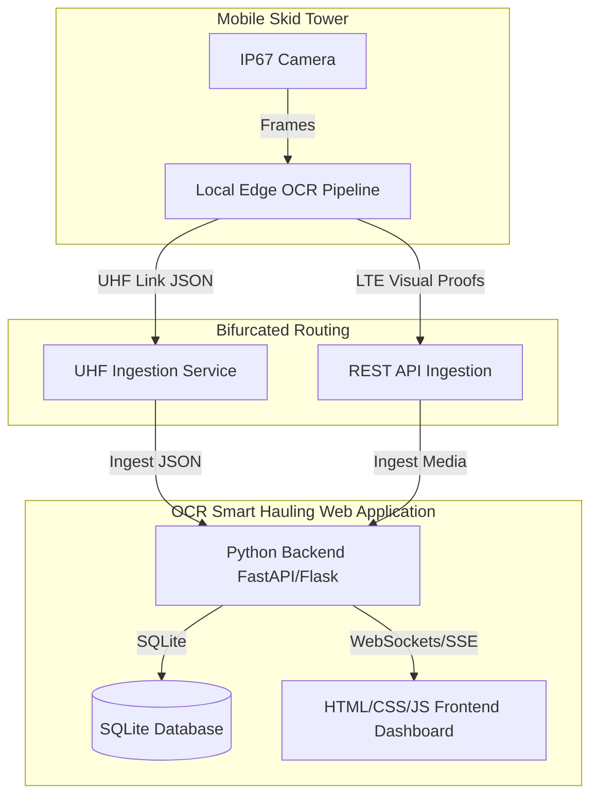

# Smart Gate: Implementation & Enhancement Plan

This document outlines the system architecture, implementation history, and active enhancement tasks for the Smart Gate (Integrated Smart Hauling System - ISHS) platform in alignment with the PRD.

---

## 1. Platform Structure & Architecture

The Smart Gate platform is designed as an edge-computing-first system with dual-telemetry redundancy, centered around a unified Web Application:

---

## 2. Platform History & Current Status

* **Status:** Phase 3 Core Capabilities Completed.
* **Labs Progress:**
  - `01-download-playlist.py`: Utility to download source OHT haulage video playlist.
  - `02-extract-videos.py`: Frame-extraction utility to sample 8 frames per video.
  - `03-extract-truck-id.py`: Prototype segmenting truck hull number regions using SAM 3.
  - `04-ocr-truck-id-using-paddle-ocr-vl-1.6.py`: Local OCR testing with PaddleOCR.
  - `05-ocr-truck-id-using-nvidia-nemotron-ocr-2.py`: Remote/local OCR testing using NVIDIA Nemotron OCR-v2.
  - `06-extract-video-using-sam3-and-ocr.py`: Integrated end-to-end pipeline with SAM3 + PaddleOCR.
  - `07-extract-video-using-sam3-and-ocr-using-nvidia-nemotron-ocr-v2.py`: Subprocess-based end-to-end pipeline utilizing Nemotron OCR-v2.
* **Completed Roadmap Tasks:**
  - **1.1 - 1.4**: SQLite Backend, SAM3 Ingestion OCR endpoint, Docker Compose wrapping, and RapidFuzz fuzzy fleet match.
  - **2.1 - 2.3**: Vanilla CSS Operations Dashboard, WebSocket live feed list, and Split-pane comparison visual audit frames.
  - **3.1 - 3.3**: Ritase shift calculator, CSV reconciliation/cloud sync buttons, and real-time remote tower telemetry bars.

---

## 3. Active Enhancement Tasks List

### Section 1: Web Application Backend (Python)

* **1.1** Implement an OCR Confidence Threshold Alerting system on the backend: If a processed crossing confidence score is below 85%, tag the record with a `low-confidence` warning status and trigger an instant WebSocket warning broadcast to active dashboard users.
  * **Status:** `[TODO]`
* **1.2** Add database backup/export JSON endpoint `/api/admin/backup-db` that serializes the SQLite database tables (fleet registry, crossings, discrepancies) and returns them as a single downloadable JSON payload.
  * **Status:** `[TODO]`
* **1.3** Implement automated telemetry anomaly checking for remote skid towers: Flag high-priority warning entries if battery levels dip below 30% or if solar panel output remains below 5W during daylight hours.
  * **Status:** `[TODO]`

### Section 2: Web Application Frontend

* **2.1** Add Interactive Telemetry Trend Charts to the Dashboard tab, allowing supervisors to click a skid tower and view battery level and solar array output trends over time in a modal chart overlay.
  * **Status:** `[TODO]`
* **2.2** Implement dark mode toggle with a sleek glowing theme switcher (Slate-Blue to Emerald-Green) to support night shift open-pit mine operators.
  * **Status:** `[TODO]`
* **2.3** Design custom context-menu options for live OHT feed cards, letting supervisors click to quick-verify or correct the matched Hull ID on the spot without reloading.
  * **Status:** `[TODO]`

### Section 3: Ingestion & Reporting Dashboard Features

* **3.1** Add Contractor Allocation Summary panel showing a pie-chart breakdown of total completed ritase cycles performed by each subcontractor to audit contractor productivity.
  * **Status:** `[TODO]`
* **3.2** Implement PDF Report Generator utilizing a print-friendly CSS stylesheet, allowing users to format and print daily shift summaries including discrepancy lists.
  * **Status:** `[TODO]`
* **3.3** Implement dynamic Edge Simulation toolbar on the Ingestion Tab, allowing users to simulate remote tower signal drops or low-battery states.
  * **Status:** `[TODO]`
