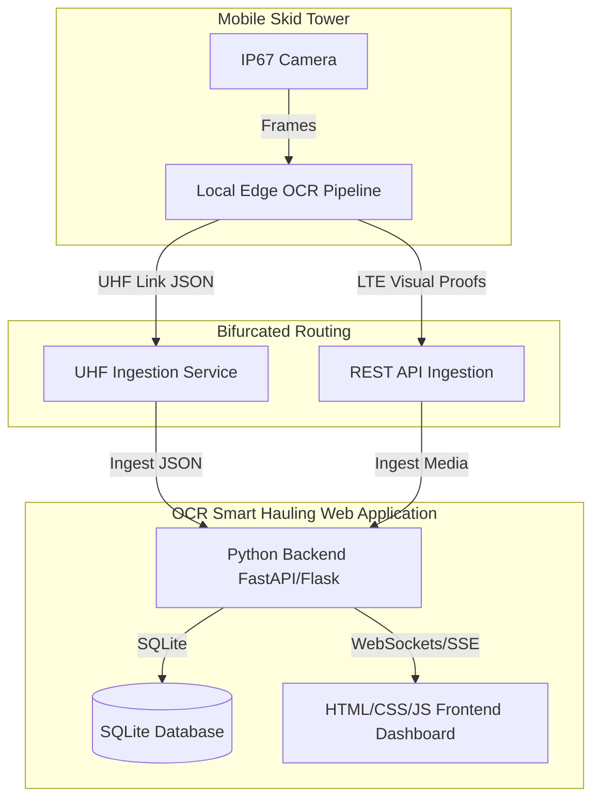

# Smart Gate: Implementation & Enhancement Plan

This document outlines the system architecture, implementation history, and active enhancement tasks for the Smart Gate (Integrated Smart Hauling System - ISHS) platform in alignment with the PRD.

---

## 1. Platform Structure & Architecture

The Smart Gate platform is designed as an edge-computing-first system with dual-telemetry redundancy, centered around a unified Web Application:

---

## 2. Platform History & Current Status

* **Status:** Phase 11 Plan Initialized.
* **Completed Roadmap Tasks:**
  - **1.16 - 1.18**: Database vacuum manager, Edge tower notification mailer, Vehicle classification distribution summary API.
  - **2.16 - 2.18**: Timeline chart legends filter, Supervisor settings drawer, Visual search term history dropdown.
  - **3.16 - 3.18**: Multi-sheet Excel reconciliation exporter, Customizable telemetry alert thresholds modal, Dashboard grid density scale slider.
  - **1.19 - 1.21**: Historical telemetry data purge API, OCR confidence calibration settings API, Mock edge telemetry stream simulator.
  - **2.19 - 2.21**: Visual alert notification flash banner, Database optimize task loader indicator, Visual filter reset button in crossing feed.
  - **3.19 - 3.21**: Telemetry battery and solar correlation chart, Supervisor shift hand-over note log, Visual color-coded map view style switcher.
  - **1.22 - 1.24**: Contractor target compliance alert API, Database automatic backup cron service, Telemetry signal quality estimator.
  - **2.22 - 2.24**: Interactive contractor warning dispatcher form, Collapsible theater mode view for visual audits, Visual contractor target compliance chart.
  - **3.22 - 3.24**: Shift distribution bar chart, Subcontractor performance comparison chart, Subcontractor compliance timeline.
  - **1.25 - 1.27**: Latency watchdog service API, Database automated compression integrity checker, Automated vehicle shift load warning service.
  - **2.25 - 2.27**: Crossing feed direction filter checkboxes, Database backup drawer download list, Telemetry SNR signal bars on map markers.
  - **3.25 - 3.27**: Contractor efficiency heat grid matrix, Cycle duration outlier scatter plot, Real-time subcontractor compliance summary widget.
  - **1.28 - 1.30**: Daily battery drain diagnostic, subcontractor email summary scheduler, database index performance advisor.
  - **2.28 - 2.30**: Mobile responsive dashboard toggle, interactive onboarding popup guide, live audio warning speech synthesizer.
  - **3.28 - 3.30**: Compliance timeline anomaly alert, subcontractor cycle speed variance chart, real-time target forecast predictions.
  - **1.31 - 1.33**: Telemetry multi-sensor anomaly detection service, geo-fencing route violation detection, backup FIFO rotation auto-cleaner.
  - **2.31 - 2.33**: Visual route replay overlay, database restore progress bar, cyberpunk/light/dark theme toggle.
  - **3.31 - 3.33**: Target forecast deviation alert banner, dispatch discrepancy heat grid, PDF report custom branding designer.
  - **1.34 - 1.36**: DB integrity check cron service, API rate limiter, contractor payload estimation endpoint.
  - **2.34 - 2.36**: Undo/redo toast notifier, grid config drawer, database backups visual timeline.
  - **3.34 - 3.36**: Contractor target deviation chart, digital signature verification, dispatch efficiency leaderboard.
  - **1.37 - 1.39**: Contractor cycle duration alert, database query TTL cache middleware, automated shift-end email report distribution scheduler.
  - **2.37 - 2.39**: Database backup growth/storage statistics widget, live gate lane camera stream simulation panel, interactive discrepancy classification filter pills.
  - **3.37 - 3.39**: Contractor fleet capacity 12-hour forecast line chart, real-time PDF print preview layout settings sidebar, leaderboard 12-hour rank sparkline timeline.
  - **1.40 - 1.42, 2.40 - 2.42, 3.40 - 3.42**: DB schema migration, API compression, system load API, telemetry sound, map zone highlights, threshold sliders, fleet heatmap, export schedule wizard, discrepancy resolve form.

---

## 3. Active Enhancement Tasks List
 
### Section 1: Web Application Backend (Python)
 
* **1.43** Build a telemetry data export CSV endpoint: Expose `/api/telemetry/export-csv` allowing operators to download raw historical telemetry logs in a CSV file.
  * **Status:** `[DONE]`
  * **Plan Breakdown:**
    1. `[DONE]` Create a new backend router `backend/routes_telemetry_csv.py` containing a `GET /reports/telemetry-csv` route.
    2. `[DONE]` Read historical telemetry list parameters from memory buffer or database.
    3. `[DONE]` Generate a string payload conforming to standard CSV columns (Timestamp, Skid Tower ID, Location, Battery Level, Solar Output, Latency).
    4. `[DONE]` Return a `StreamingResponse` wrapping the CSV buffer with `text/csv` media header and download attachment disposition.
    5. `[DONE]` Register the router in [backend/routes.py](../backend/routes.py).
* **1.44** Implement DB vacuum and defragment scheduler: Run an automatic SQLite VACUUM task every 7 days and log details in audit logs.
  * **Status:** `[TODO]`
  * **Plan Breakdown:**
    1. `[TODO]` Create `backend/db_vacuum.py` housing SQLite `VACUUM` processing logic.
    2. `[TODO]` Add system setting check in `database.py` (e.g. `db_vacuum_interval_days`, default to 7 days).
    3. `[TODO]` Build background thread routine that executes the defragment query sequentially.
    4. `[TODO]` Compute database file size before and after execution, and commit a detailed entry in the `audit_logs` table.
* **1.45** Build an OHT classification status change logger endpoint: Add a route `POST /api/trucks/status` that logs contractor vehicle status changes to audit logs.
  * **Status:** `[TODO]`
  * **Plan Breakdown:**
    1. `[TODO]` Update `backend/routes_trucks.py` to add `POST /trucks/status` route.
    2. `[TODO]` Retrieve old vehicle status and write status transition details (e.g., active -> inactive).
    3. `[TODO]` Log an administrative entry inside `audit_logs` specifying truck ID, transition values, operator, and timestamp.
 
### Section 2: Web Application Frontend
 
* **2.43** Add a telemetry CSV export button: Add an "📥 Export Telemetry" button inside the mobile skid towers dashboard card to download telemetry CSV data.
  * **Status:** `[DONE]`
  * **Plan Breakdown:**
    1. `[DONE]` Locate the remote diagnostics / mobile skid towers card panel header in [frontend/index.html](../frontend/index.html).
    2. `[DONE]` Insert `<button class="btn btn-secondary btn-sm" id="btn-export-telemetry" style="padding: 0.15rem 0.4rem; font-size: 0.65rem;">📥 Export Telemetry</button>`.
    3. `[DONE]` Register click handler event delegation in [frontend/telemetry_logs.js](../frontend/telemetry_logs.js) opening `window.open('/api/reports/telemetry-csv')`.
* **2.44** Implement interactive search term query highlights for trucks list: Highlight matching characters dynamically inside the fleet manager registry list as supervisors type search terms.
  * **Status:** `[TODO]`
  * **Plan Breakdown:**
    1. `[TODO]` Add an event listener to the search input element inside [frontend/fleet_manager.js](../frontend/fleet_manager.js).
    2. `[TODO]` Match typing inputs dynamically inside OHT Hull ID tags.
    3. `[TODO]` Wrap matching sequences in a CSS-highlighted `<mark>` tag dynamically while retaining normal table interactions.
* **2.45** Create a diagnostic checkup list view: Expose a collapsible drawer listing all DB integrity check alerts with quick-fix buttons inside the fleet manager tab.
  * **Status:** `[TODO]`
  * **Plan Breakdown:**
    1. `[TODO]` Add a diagnostics drawer modal overlay layout inside the fleet manager view of [frontend/index.html](../frontend/index.html).
    2. `[TODO]` Write a script `frontend/fleet_diagnostics.js` to fetch integrity reports dynamically from `/api/admin/db-integrity`.
    3. `[TODO]` Render diagnostic items (such as missing proof images or unregistered crossings) alongside context quick-fix buttons.
 
### Section 3: Ingestion & Reporting Dashboard Features
 
* **3.43** Build a subcontractor compliance progress timeline anomaly forecast chart: Animate line trajectories showing deviation forecasts based on historic daily ritase rates.
  * **Status:** `[TODO]`
  * **Plan Breakdown:**
    1. `[TODO]` Create `frontend/compliance_forecast_chart.js` component using Recharts or SVG drawing methods.
    2. `[TODO]` Fit linear trajectory slopes using historic contractor compliances.
    3. `[TODO]` Draw projected compliance rates leading to shift end to spot anomalies in advance.
    4. `[TODO]` Link script tag to [frontend/index.html](../frontend/index.html).
* **3.44** Create a dashboard layout customization settings reset button: Add a "Reset Grid" button to the grid layout drawer that restores default visibility and order for all metrics cards.
  * **Status:** `[TODO]`
  * **Plan Breakdown:**
    1. `[TODO]` Append a reset button `<button class="btn btn-secondary" id="btn-reset-layout" style="width: 100%;">Reset Default Layout</button>` inside `#grid-config-drawer` body in [frontend/index.html](../frontend/index.html).
    2. `[TODO]` Edit [frontend/grid_config_drawer.js](../frontend/grid_config_drawer.js) to clear layout caches inside browser `localStorage` on click.
    3. `[TODO]` Trigger dynamic page reload to re-render default card positions and visibilities.
* **3.45** Build a visual shift change log feed: Expose an operational notes stream showing shift handover digital signature details in the analytics tab.
  * **Status:** `[TODO]`
  * **Plan Breakdown:**
    1. `[TODO]` Create a log feed card element in [frontend/index.html](../frontend/index.html) inside the Reports/Analytics page.
    2. `[TODO]` Query shift change entries from audit logs history endpoint `/api/admin/audits` dynamically.
    3. `[TODO]` Format and list handover reports displaying signature names, timestamps, and seal tokens chronologically.

---

# Smart Gate Platform - Feature Catalog

This document tracks all active visual, analytical, and edge control modules implemented on the Smart Gate platform for PT Tunas Inti Abadi and PT Borneo Indah Cemerlang open-pit coal mining operations.

---

## 1. Operations Hub
*   **Haulage Terminal**:
    *   *Real-Time Ledger & Interactive Crossing Feed*: Displays chronological OHT crossings with unique transaction hashes, confidence scores, payloads (Loaded vs Empty), and high-resolution OCR camera proof mockups.
    *   *Manual OCR Results Editor*: Allows operators to edit OCR scan results (`Hull ID` and `Confidence` values) directly within the visual audit evidence panel.
    *   *Intelligent Verification Audit Lock*: Enforces strict business validations on unknown (`DT-UNKNOWN`) or low-confidence scans (accuracy below the 95.0% threshold). The operator is blocked from saving corrections or approving crossings unless they either manually correct the Hull ID or provide mandatory remarks/discrepancy reasons.
    *   *Manual Gate Override Log*: Allows Field Auditors to manually log physical fail-safe crossings when mud blocks the camera lenses or cellular connectivity goes offline.
    *   *High-Level KPI Cards*: Consolidates vital key metrics including active fleet deployment state (Active OHT Units vs total registered units), operational throughput volume (Total Daily Crossings split by cargo ratio with a dynamic 'Trend Arrow' indicator comparing hourly rates), and telemetry health alarms (Tower Critical Status) directly at the top of the terminal dashboard. Features a subtle, high-performance 'pulse' animation (including ring glowing, soft background tint transitions, and elastic scale effects) when telemetry, fleet, or crossing events are updated in real-time.
    *   *Calendar-Based Activity Heatmap & Peak Hours Matrix*: Visualizes haulage crossing event intensity and volume over the last 30 days. Includes a multi-mode switcher supporting a continuous 30-day interactive calendar grid (with single-day detail drill-down audits, including total crossings, est. tonnage, peak hour, and busiest truck) and an aggregated 7-day-of-week by 24-hour peak-hours traffic matrix, complete with interactive lane and cargo filters, a color-coded heat intensity scale, and automated AI peak-hours detection reporting.
    *   *24-Hour Tower Vibration & Temperature Trend Chart*: Integrates a Recharts-based multi-line dual Y-axes chart in the main dashboard view to visualize core temperature and mechanical vibration trends of mobile skidding towers over the last 24 hours. Includes a dropdown selector for real-time node diagnostics, warning thresholds visualization, and an **interactive legend toggling feature** allowing users to click individual legend parameters (Temperature or Vibration) to dynamically show/hide the corresponding lines and Y-axes.
    *   *IT Administrative Alarm Threshold Override Panel*: A terminal register panel allowing authenticated IT Administrators to set custom warning and emergency critical limits for both skidding tower core CPU temperatures and vibration mechanical pressure stress alerts. Features interactive fine-grained sliders, a live active connection state heartbeat, a factory-reset restorer, and a built-in "IT Admin role elevator" to instantly simulate administrative credentials for seamless system-wide alarm calibration.
    *   *Real-time Toast Notification Dispatcher*: An immersive, high-priority background alerting overlay running continuously inside the `App` container:
        *   **Dynamic Crossing Interception**: Actively screens incoming haulage logs to detect unregistered (`DT-UNKNOWN`) or sub-optimal OCR scans (confidence below 95%). Instantly fires visual warnings allowing quick one-click routing to the Operator Dashboard.
        *   **Multi-Tab Telemetry Surveillance**: Intercepts skidding tower updates in the background. If temperature, vibration, or battery life breaches configured IT thresholds while the operator navigates secondary tabs (CCTV, Fleet, Predictive Analytics, etc.), a highly visual diagnostic toast slides into view.
        *   **Aesthetic HUD Design**: Toasts are modeled with dark slate colors, color-coded emergency lightbars (orange/red), interactive tab-redirection pathways, auto-dismiss timers, and matching remaining duration progress loaders.
    *   *High-Contrast Day Mode*: A user-accessible theme toggle positioned in the central global `Header` control hub:
        *   **Dynamic Visual Adaptation**: Seamlessly flips the entire platform layout from the standard futuristic slate dark canvas into an ultra-bright, glare-reducing, high-contrast light theme.
        *   **Operational Optimization**: Configured specifically to enhance visibility of real-time telemetry metrics, OHT unit IDs, and live CCTV status graphs under harsh, direct outdoor sunlight at open-pit mine sites.
        *   **Local State Persistence**: Instantly commits the selected style configuration to local storage, maintaining preference state transitions continuously across browser refreshes.
*   **CCTV Surveillance**:
    *   *Live RTSP Feeds & OCR Extraction*: Simulates live dual-camera feeds simultaneously (CAM 01 Entrance & CAM 02 Exit) side-by-side for each active location. Includes live IP URL watermarks, active frame-rate indicators, and codec parameters.
    *   *Temporal Multi-Frame Consistency HUD*: Visualizes sequential frame-by-frame text capture (processing frames dynamically based on configuration), demonstrating how the edge algorithms vote on final text consistency to filter out headlight glare.
    *   *Configurable Frame Consistency & OCR Verification*: Provides live sliders inside the camera feed's "Pipeline Config" panel to customize the edge temporal voting analyzer parameters:
        *   **Verification Frames** (3 to 12 frames): Number of consecutive snaps captured per truck sequence.
        *   **Processing Window** (1 to 8 seconds): Duration allocated for temporal vote reconciliation.
        *   **Confidence Guard** (90% to 99%): The baseline confidence threshold for automatic logs approval.
        *   *Reactive Real-Time Explanation*: The operational explanation block and telemetry mathematical readout update dynamically based on the active configuration.
    *   *Real-Time OCR Confidence Score Overlays*: Enhances both live scanning states and idle feeds with rich telemetry overlays:
        *   **Live Real-Time Confidence HUD**: Displays a fluctuating live OCR confidence ticker directly on the crop card of the active camera stream during processing, capturing the real-time quality score of the edge model's frame sampling.
        *   **Persistent Analytical Feed Overlays**: When a camera feed is idle, a custom HUD is overlaid at the bottom displaying the last recognized OHT unit ID, its timestamp, and its final calculated OCR confidence score (color-coded to green/amber based on whether it passes the active Confidence Guard).
    *   *Dedicated CCTV OCR History Page*: A fully functional standalone historical logs archive, featuring custom filters (fuzzy text query, archive date selection, confidence scoring range), sorting options, and comprehensive visual audit proof inspector showing multi-frame voting records.
*   **Fleet Registry**:
    *   *Fleet Master Database*: Provides a secure, searchable registry tracking all registered Off-Highway Trucks. Filters assets by contractor (Tunas Inti Abadi, CK, PPA, BIC) and operational status.
    *   *Register New Hauler Unit*: A form-based utility allowing Operations Managers to register new trucks with custom payload capacities, assigned drivers, and contractors.
    *   *Fleet Status Toggle*: Allows real-time toggles to tag trucks as Active, Under Maintenance, or Inactive.

## 2. Performance & Reports
*   **Real-Time Analytics**:
    *   *Dynamic Cycle Time Tracker*: Computes true roundtrip cycle times by tracking consecutive crossings of individual trucks.
    *   *24-Hour Cycle Duration Bottleneck Chart*: Visualizes average cycle times using a beautifully styled Recharts AreaChart with an orange gradient. Superimposes target lines and flashes high-priority "BOTTLENECK ACTIVE" alerts during shift handovers.
    *   *OHT Cycle Stages Delay Segment Chart*: A stacked bar chart visualizing a detailed breakdown of the four cycle stages: **Loading Stage**, **Hauling (Loaded) Leg**, **Unloading Stage**, and **Returning (Empty) Leg** grouped in 4-hour windows.
    *   *Cycle Duration Distribution Histogram*: Renders a high-resolution Recharts histogram segmenting OHT cycle durations into 10-minute frequency intervals. Highlights optimal vs. delayed cycle ratios with an interactive dual-colored linear bar, and diagnoses efficiency bottlenecks like crew shift handover stalls or road-surface wetting delays.
    *   *Active Fleet Utilization Meter*: Displays live percentage gauges of active versus idle haulers based on actual OCR logs during the current shift.
*   **Shift Reporting**:
    *   *Time-Filtered Performance Auditor*: Scopes and audits performance across custom start and end times (e.g., Day Shift 07:00-19:00, Night Shift 19:00-07:00, or any Custom Filter).
    *   *Real-Time KPIs vs Targets*: Tracks actual shift ritase (cycles) and tonnage against shift targets with responsive progress bars.
    *   *Hourly Load Profile*: Visualizes crossing volumes in an interactive Recharts Bar Chart specifically scoped to the shift's exact hour buckets.
    *   *Subcontractor Tonnage Breakdown*: Tabulates contractor-specific share of total ritase and tons.
    *   *Direct Export Actions*: Supports direct CSV downloads of the shift crossing ledger and system print reports.

## 3. Edge & Diagnostics
*   **Checkpoint Inspector**:
    *   *2x2 Grid View Page*: A dedicated full-page 2x2 grid view monitor highlighting all four major mine site gates: CK North, PPA North, South Pit Gate 01, and South Pit Gate 02.
    *   *Real-Time Traffic Metrics*: Summarizes total shift crossings, loaded vs. empty ratio, last vehicle scan (with timestamp, confidence level, and OHT number).
    *   *Multisensor Edge Telemetry*: Consolidates vital edge statistics (battery level, solar panel power, cpu junction temperature, rms vibration) directly alongside the traffic ledger.
    *   *Edge Action Triggers*: Supports simulated physical operations like remote mud wash, low-power UHF override state toggles, and resetting localized crossing counters.
*   **Skidding Towers**:
    *   *Solar Mobile Skidding Towers Monitor*: Continuously monitors battery SOC, temperature, solar panels, and hardware connectivity on remote solar trailers.
    *   *Real-Time Edge Heartbeat LED*: A small pulsing LED-style status indicator at the top of each skidding tower card, dynamically representing edge signal strength and connection quality (Excellent, Weak, UHF Backup, or Offline).
    *   *Low-Power Monsoon Override*: A remote control switcher shutting down high-draw cellular LTE radios and switching 100% of telemetry to industrial low-frequency Satel UHF radio to conserve battery during rainy seasons.
    *   *10-Hour Historical Telemetry Trends*: A rich Recharts board tracking Battery Voltage, Processor Junction Temperature, and Skid Vibration curves against safe thresholds.
*   **Hardware Specs**:
    *   *Trailer Engineering Specifications*: Provides interactive structural drawings and blueprints detailing the ruggedized construction of the solar skidding trailer.
    *   *Dual-Axis Solar Actuator*: Schematic for 450W monocrystalline PV panels.
    *   *Lithium Iron Phosphate (LiFePO4) Power Storage*: Blueprint for the temperature-regulated battery bank.
    *   *Jetson Orin Edge AI Node*: Specifications for the NEMA 4X enclosure housing the 100 TOPS AI computing unit.

## 4. Asset Maintenance
*   **Predictive Maintenance**:
    *   *AI failure forecasting*: Models degradation curves to project remaining operational life (in days) for LiFePO4 batteries, optical lenses, and solar panels.
    *   *Critical Battery Voltage Warning System*: Monitors real-time voltage and flags skidding towers with an orange or red alert badge when their battery voltage falls below a user-adjustable critical threshold (ranging from 23.0V to 26.5V).
    *   *Urgent Status Filter*: Dynamically filters the list of towers to display only nodes that have been flagged with 'Urgent' status due to low-voltage conditions.
    *   *24-Hour Battery Telemetry History Chart*: Integrates a modern Recharts line chart in the main diagnostics screen showing a rolling 24-hour voltage timeline. The chart renders realistic diurnal solar charge profiles, anchors dynamically to the selected tower's real-time battery voltage, and overlays the user-configured low-voltage alarm set point.
    *   *Live Field Intervention Simulation*: Interactive action controllers allowing operators to simulate maintenance in real-time:
        *   *Wash Lens*: Instantly clears mud and resets optical degradation losses.
        *   *Dampen Trailer Skids*: Re-engages hydraulic jacks to anchor the mobile platform, dampening vibration to 1.0 mm/s.
        *   *Swap Battery Bank*: Swaps degraded lithium blocks for fully-conditioned replacement cells.
*   **Maintenance Analytics**:
    *   *Multi-Node Comparison Canvas*: Superimposes sensor drift data across multiple selected towers to isolate anomalies.
    *   *Historical Sensor Trend Lines*: Quick-switch telemetry overlays for Battery Voltage, Processor Junction Temperature, and Skid Vibration.
    *   *Predictive Health Priority Queue*: A scored prioritization model identifying which skidding towers represent the highest wear indices and requires active technician dispatch.
*   **Regression Forecast**:
    *   *OLS Predictive Regression Models*: Uses an ordinary least squares linear regression algorithm to fit mathematical trend lines ($y = mx + c$) over 10-hour historical intervals for skidding tower vibration and core temperatures.
    *   *Continuous Projection & Boundary Intersection*: Evaluates the exact future intersection timestamp with the user-configured critical thresholds, diagnosing failure-mode triggers in advance.
    *   *Interactive Stress Tuning Simulation*: Integrated coefficient sliders that allow operators to simulate vibration multipliers and ambient thermal stress, instantly recalculating regression slopes, $R^2$ confidence scores, and hours-to-limit values.
    *   *Comprehensive Forecasting Table*: An advanced analytical grid showing all registered skidding towers, their respective slope trajectories, regression equations, model fits, and failure countdown timers.

## 5. Decision Engine
*   **AI Copilot**:
    *   *Secure On-Site Gemini Assistant*: A chat interface powered by local models or live server-side Gemini integration.
    *   *Pre-baked Quick Queries*: Assists operators in rapidly generating reports ("Audit contractor balances", "Analyze shift totals", "Check towers' health").
    *   *Strict Manual Trigger Enforced Policy*: Blocks background scans, auto-analysis on loading, and other automated run vectors, requiring explicit manual execution to preserve data integrity.

## 6. Global Platform System Switchers
*   **Demo vs Live Toggle Control**:
     *   *Demo*: Reads static mockup JSON files directly from the `./data/mockup/` storage layout to support offline sandboxed presentations.
     *   *Live*: Submits live operational logs and coordinates changes with persistent system storage.
*   **Cloud vs On-Premise Deployment Selector**:
    *   *Local (On-Premise)*: Directs traffic to local, self-hosted Express REST endpoints (`./api/fleet`, `./api/crossings`, `./api/towers`), ensuring data sovereignty during deep pit operations.
    *   *Cloud*: Redirects API endpoints to secure cloud-hosted endpoints with artificial latency simulation to model secure wide-area cellular connectivity.

## 7. Left Navigation Sidebar
*   **Five-Category Navigation Tree**: Organizes the system into *Operations Hub*, *Performance & Reports*, *Edge & Diagnostics*, *Asset Maintenance*, and *Decision Engine*.
*   **Menu Fuzzy Search**: Real-time filtering matching label text and descriptions to instantly spotlight matched sub-modules.
*   **Global Expand/Collapse Panel state**: A dedicated toggle compresses the left panel into a high-density icon-only rail to allocate maximum screen space to heavy data visualizers.
*   **Show/Hide Category Controls**: Custom settings selectors permitting users to show/hide specific functional categories from the menu tree, satisfying strict customized operating environments.
